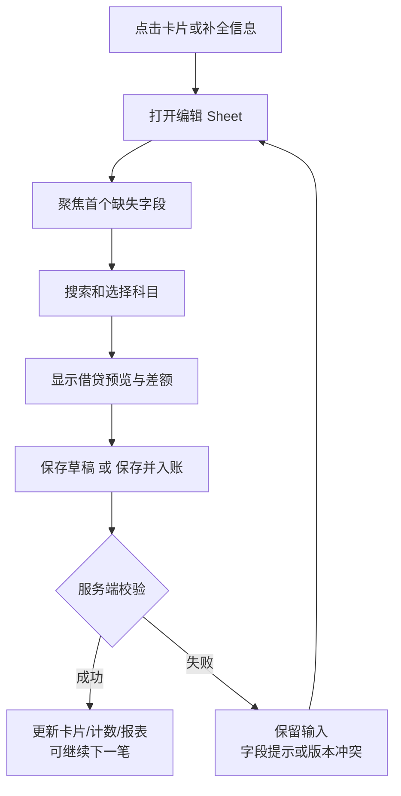

# 移动端 UI 与交互方案

状态：设计规格，尚未实现或通过浏览器验收。首期界面中文，默认浅色，支持跟随系统的深色主题。

## 1. 信息架构

手机以「总览 / 流水」两个一级入口组成底部导航；头像菜单提供账本、账户维护、金额隐藏、主题与退出。主操作为「记一笔」FAB；待补录作为流水筛选状态及总览提醒入口，不重复建第三个页面。

| 路由 | 内容 |
| --- | --- |
| `/` | 总览；期间、三类报表和数据质量 |
| `/transactions` | 全部流水，`review=needed` 表示待处理；筛选写入 URL |
| `/transactions/new` | 手工新增，支持刷新后明确恢复/重新开始 |
| `/transactions/:id` | 详情与补录，返回原列表位置 |
| `/auth/callback` | 登录回调，清理授权参数后回到合法站内路径 |

移动端 `<600px` 单列卡片，左右边距 16px；`600–899px` 提高边距并限制表单宽度；`≥900px` 改为左侧导航、总览多列、流水列表加详情栏。桌面可提供紧凑表格切换，手机固定卡片。内容最大宽度约 1280px，表单主要区域不超过 640px。

## 2. 总览页

首屏回答净资产和本月变化，随后是资产负债、现金流量、损益三组完整内容。顶栏月份控制现金流和损益期间，资产负债显示该期间截止日的余额；正在进行的月份截止当前时点，并明确显示「截至…」。

```text
┌─────────────────────────────┐
│ 财务总览           隐藏金额 头像 │
│ ‹  2026年9月  ›     自定义期间 │
│                             │
│ 净资产            截至 9/13 │
│ ¥ 128,600.00                │
│ 较期初 +2,600.00            │
│ [净资产趋势折线]             │
│                             │
│ 资产 ¥168,600  负债 ¥40,000 │
│ [账户分组与余额，查看全部]    │
│                             │
│ 现金流量               详情 ›│
│ 流入 20,000  流出 14,800    │
│ 净流入 +5,200               │
│ [生活 / 投资 / 筹资分类]     │
│                             │
│ 本期损益               详情 ›│
│ 收入 20,000  支出 17,400    │
│ 净收益 +2,600               │
│                             │
│ 仍有交易待补全        去处理 ›│
│ 报表暂未覆盖这些交易         │
│                    [＋记一笔]│
│       总览        流水       │
└─────────────────────────────┘
```

金额为虚构线框示例，净现金变动与净收益有意不同，体现两者口径区别。

- 资产负债：资产/负债总额、净资产、分组余额和趋势；负债按欠款正值表达；资产负债率只在分母有效时显示。
- 现金流：显示现金范围说明、流入、流出、净额及生活/投资/筹资分类；现金内部转账单独查看，不放大收支。
- 损益：本期收入、支出、净收益和主要类别；以简洁横条/趋势呈现，少量类别优先文字明细。
- 点指标下钻到同期间同口径流水；抽屉解释公式、现金范围与排除项。无数据、数据尚不完整、统计值为零是三种状态。
- 不完整提示同时覆盖所选期间与资产负债累计范围：期前缺项也可能影响当前余额。无法量化的缺失交易显示笔数，不伪造缺失金额。
- 金额隐藏将所有金额、图表 tooltip、无障碍摘要中的敏感数值一并替换，不仅隐藏净资产卡。

## 3. 流水交易卡片

顶部搜索（商户/摘要），月份选择，筛选 chips「全部 / 待补录 / 待匹配」，其余条件放筛选 Sheet：交易状态、收支类型、账户、渠道。按日期分组，采用游标分页，单次建议 30 笔；显示明确「加载更多」兜底。

```text
┌─────────────────────────────┐
│ 流水                  搜索 筛选│
│ 全部  [待补录]  待匹配       │
│ 9月13日                     │
│ ┌─────────────────────────┐ │
│ │ 餐饮 · 示例商户  -¥68.00 │ │
│ │ 12:30 · 微信 · 交易成功  │ │
│ │ 支出 / 餐饮             │ │
│ │ 付款账户：待匹配        │ │
│ │ [待匹配账户] [待核对]   │ │
│ │                [补全信息]│ │
│ └─────────────────────────┘ │
│ ┌─────────────────────────┐ │
│ │ 示例交易       金额待补录│ │
│ │ 09:20 · 交易成功         │ │
│ │ 尚无分录                │ │
│ │                [补全信息]│ │
│ └─────────────────────────┘ │
│                    [＋记一笔]│
│       总览        流水       │
└─────────────────────────────┘
```

卡片第一行商户/摘要与金额，第二行时间/渠道/付款状态，第三行科目或转出 → 转入关系，底部展示缺失字段和唯一主操作。金额必须由交易分录推导并避免借贷重复相加；无分录显示「金额待补录」，不显示 0。复杂复合交易显示中性金额及「多分录」，不勉强标成收入或支出。

「交易成功/退款」是来源交易状态；「草稿/已入账/待核对」是记账状态；缺失字段是独立质量标签。三者在界面上分层展示。

## 4. 补录与匹配流程



手机编辑采用接近全屏的底部 Sheet；复杂分录/键盘打开时扩为全屏。上方有标题和关闭，内容单一滚动，底部保存区考虑 `env(safe-area-inset-bottom)` 与软键盘。不让多个嵌套弹层争夺滚动和焦点。

编辑顺序：交易类型（支出/收入/转账/还款/退款/高级）→ 金额 → 日期时间 → 来源/目标账户与分类科目 → 商户/备注 → 分录预览。已有金额和信息预填；高级模式支持增加、删除与拆分分录，同时显示借方合计、贷方合计与差额。

账户选择按语义分组：支付/收款账户优先资产、负债；消费分类选择支出科目；收入分类选择收入科目；显示 type、subtype、name，必要时附 notes 消歧。搜索、最近使用、同商户历史推荐可辅助选择，推荐附依据，必须由用户确认。付款渠道「微信」不自动等于微信零钱科目。

新增账户作为选择器中的辅助操作，填写类型、子类和名称；账户停用保留历史分录，不提供无保护的硬删除。

保存中按钮显示状态并阻止重复触发；失败保留全部字段。服务端确认后更新列表和统计；「保存并下一笔」只在用户主动选择时跳转，保持当前筛选范围。卡片从待处理队列移出后宣布新的剩余数量，屏幕焦点落在下一张卡片或完成提示上。

版本冲突以「这笔交易已在其他设备更新」显示服务端新值和本地输入，由用户选择重新编辑。关 Sheet、路由返回遇到未保存内容时提示；刷新/登录跳转造成内存草稿丢失的边界需清楚说明。首期离线不自动排队提交，在线草稿保存在数据库；持久离线同步后续实现。

已入账金额变更需查看影响，采用带审计的修订/冲销策略。Snackbar 不提供虚假的“撤销保存”；如做撤销，必须调用有版本校验的反向操作，已入账交易使用冲销并重新计算报表。

## 5. 主题与组件规范

| 项目 | 方案 |
| --- | --- |
| 主色 | 稳重蓝 `#2458A6`，on-primary 白；最终组件状态需测对比度 |
| 浅色表面 | 背景 `#F7F9FC`，卡片 `#FFFFFF`，主文字 `#172033` |
| 深色表面 | 背景 `#10141C`，卡片 `#1B2230`，主文字 `#E8EDF5`，主色 `#A8C7FA` |
| 金额语义 | 收入/流入附“+”和文字，支出/流出附“−”；错误独立使用 error token，不把支出都当错误 |
| 字体 | 系统中文无衬线；正文/输入 16px，辅助 12–14px，净资产 32–36px；金额 tabular-nums |
| 间距/形状 | 4/8px 基础节奏；卡片间距 12px、内距 16px，圆角 16px，Sheet 顶部 24px |
| 触控 | 主要控件点击区域至少 48×48 CSS px；图标搭配可访问名称 |
| 组件 | 复用 MUI Card、Chip、Autocomplete、Dialog/Drawer、TextField、Button、FAB、Snackbar |

样式通过 semantic tokens 和 theme overrides 集中定义；普通内容面使用轻边界和低阴影，不用玻璃背景影响读数。图标统一 MUI SVG，图表颜色与数值表述同步。关闭动画后信息关系仍然完整。

## 6. 交互与动效

| 事件 | 动效意图与时长目标 |
| --- | --- |
| 点击卡片/按钮 | 约 80–120ms 内出现 ripple/state layer，不移动周围布局 |
| Sheet 打开/关闭 | 进入约 240ms、退出约 180ms，opacity + transform；可打断 |
| 匹配完成 | 科目标签淡入约 150ms，缺失标签替换；不整页闪动 |
| 保存成功移出队列 | 确认后短淡出，保留滚动锚点；不每次重新播放全部卡片入场 |
| 图表/数值刷新 | 更新内容并标示完成；避免金额滚轮动画拖延阅读 |
| 加载 | 预留卡片尺寸，慢请求使用 skeleton；真实空结果才显示空状态 |

`prefers-reduced-motion` 下取消位移、弹簧和交错入场，保留即时状态切换。主要操作都提供可见按钮，不依赖左右滑动；保留浏览器返回手势。焦点环、Sheet 焦点锁定/归还、错误摘要、`aria-live` 保存反馈均纳入验收。动效时长是设计目标，尚未性能实测。
