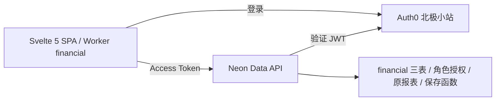

# 技术架构

Svelte 5 + TypeScript + Vite SPA，Bits UI + shadcn-svelte（preset `b6sUj31yy`）+ Tailwind CSS 4 + Lucide，pnpm 管理依赖。Cloudflare Worker 只托管静态资源；业务数据直接调用 Neon Data API（PostgREST 兼容），业务读取视图与保存函数统一在 `financial`。

## 接入

- Auth0 tenant：hasbai.eu.auth0.com。
- 北极小站：SPA，公开 client ID `mdmD7xvX5yay52SRVZeuIOhGHIa0Wdl2`。
- Audience：`https://financial.hasbai.xyz/api`，RS256，Access Token 有效期一小时。
- Callback：`https://financial.hasbai.xyz/auth/callback`、`http://localhost:5173/auth/callback`。
- Logout / Web Origins：上述两个 origin。
- `@auth0/auth0-spa-js` 官方 SPA SDK 使用 Authorization Code + PKCE，token 仅在内存；每次请求调用 getTokenSilently，退出清除查询缓存。生产代码不处理密码。
- Auth0 Post Login Action 将 superadmin 写入 Access Token 顶层 role；Neon Data API 使用 `.role` 切换到 PostgreSQL superadmin。

Neon 项目 `mute-king-39794724` / neondb。开发分支 `br-proud-bread-b3hl3asf`，production 分支 `br-billowing-violet-b3pkbm3s`。公开的前端配置见 src/lib/config.ts；默认使用生产 endpoint，测试可通过 VITE_DATA_API_URL 替换目标 endpoint。

Data API 的 JWT 校验发生在 Neon，PostgreSQL 根据 superadmin 的 schema 和对象授权决定访问。纯前端不意味着允许公开访问数据库。[Neon 外部身份支持](https://neon.com/docs/data-api/custom-authentication-providers)

## 应用结构

- `src/pages`：总览、流水、编辑、科目。
- `src/lib/api.ts`：使用 Neon PostgREST SDK，自动取得 Auth0 token。直接 GET balance、balance_history、cashflow、income_statement、transactions 和 account；数值列取十进制字符串，客户端 Decimal 完成汇总、分类、日期分组和首页结构组装。只有保存使用 RPC。
- `@tanstack/svelte-query`：通过 Svelte 5 accessor 查询缓存、游标分页与保存后刷新。
- `src/lib/reports.ts`：报表片段与源行共用 QueryClient 内存缓存；首页从现有报表并发读取，后续明细复用源行，不为一次 HTTP 再拼后端 home 视图。关闭金额时不取余额历史。
- balance/balance_history 物化视图直接授予 superadmin SELECT；保存完成后在同一事务刷新。外部批量维护使用 scripts/refresh-balances.mjs。
- 保存使 overview/transactions 及其源行查询失效；科目只读取一次完整列表，首页现金配置与流水标签共同复用。报表、源行、科目及精确截止时点在当前页面会话内保留，不因30秒过期、切页、聚焦或重连重复获取。跨北京时间日期后重新进入页面刷新报表；保存后刷新受影响数据，浏览器刷新重建会话并重新读取，退出清空同一个 QueryClient。历史余额直接读取每日快照，现金图一次按日聚合，不再每六天重复查询。
- `Repository.overview` 保留核对入口，其余额采用新物化视图，现金和损益使用现有视图；不读取已删除的 balance_sheet/cashflow_statement。
- Svelte 5 runes：编辑状态与分录数组；快照提交，原分录 ID 和 updated_at 保留。
- Decimal.js + SQL numeric：金额输入与计算。
- Svelte SVG：趋势展示及逐日可访问明细；坐标用 Number，仅用于呈现，基础报表金额来自 SQL，页面汇总采用 Decimal。

- `src/lib/auth.svelte.ts`：Auth0 初始化、回调、登录/退出及取 Access Token，SDK 按需加载。
- `src/lib/router.svelte.ts`：History API 路由、查询字符串、返回与未保存提醒；保持原 SPA 路径。
- `src/lib/context.ts`：Svelte context 注入 Repository；测试注入替身，不加入生产绕过认证开关。
- `src/lib/editor.ts`：表单初始化和退款分录输入；SQL 负责最终保存校验。
- `svelte-check` 同时检查 Svelte 与 TypeScript；TypeScript 6 是当前 svelte-check 声明支持的主版本。

## 发布

`wrangler.jsonc` 配置 Worker financial、dist 静态目录、single-page-application 回退与 financial.hasbai.xyz 自定义域名。`public/_headers` 配置缓存、安全头。推送 main 后由 Cloudflare Workers Builds 自动构建并部署，不重复执行手动 Wrangler 发布。

GitHub Actions 进行 frozen-lockfile 安装、typecheck、test、build。数据库迁移由本次交付主动执行：隔离验证通过后迁移生产、核验真实 API，再提交推送，随后核验 Cloudflare 自动部署和线上资源。迁移、提交、推送一并完成，不把迁移留待额外授权。变更存在新旧版本依赖时先安排兼容步骤。006_role_access.sql 已迁移生产，角色授权和原报表直读已通过生产验收。生产发布状态记录在 [PROGRESS](PROGRESS.md)。

回滚优先退回 Worker 版本；数据库不新增字段、不删除原数据。共享 Neon endpoint 的 provider 配置修改前必须核查原消费者；不调整其他 Auth0 application。

## 程序化验证

按用户要求，本地 `.env` 保存 AUTH0_TEST_EMAIL / AUTH0_TEST_PASSWORD，权限600且被Git忽略，不进入构建。`scripts/auth0-token.mjs` 只供本机检查：通过 Auth0 Universal Login 正常账号页/密码页、Cookie 会话、Authorization Code + PKCE 获取本人 Access Token。无需 Auth0 CLI 管理登录、client secret 或临时修改 grant；不改写 `.env`。授权回调严格校验 state，凭据仅提交同一 Auth0 origin，遇 MFA/CAPTCHA 等额外验证时明确停止。生产 SPA 继续使用官方 SDK，测试脚本不进入浏览器。

角色配置见 auth0/financial-role.js：仅 financial API audience 且 Auth0 角色包含 superadmin 时设置顶层 role。2026-09-15 隔离实测命名空间 claim 虽被注入 JWT，Neon 未切换角色；顶层 role 配合 `.role` 已通过真实 API。错误签名、错误 audience 与无 token 均由 Data API 拒绝；业务函数不再重复检查 JWT。

## 首页请求复用

- 冷启动需要六类源 GET（分页超过1000行时有续页）：balance、income_statement、cashflow、transactions质量、account完整科目、balance_history。隐藏金额时省去余额历史，共五类。
- account不再单查“现金及等价物”ID；完整科目列表供首页配置判断、流水筛选、科目设置及编辑共用，保存科目后全量失效，保存交易不重读科目。
- 首页资产/损益/每日历史面板复用原始行；cashflow优先复用已缓存且覆盖所需半开时间区间的完整行，再用原有微秒边界裁剪。历史余额缓存按实际请求日期键控。
- 隐藏后首次显示金额只补余额历史；失败重试只重读失败源。所有源缓存位于应用注入的同一QueryClient，不保存到localStorage，退出清空也覆盖在途查询。
- Auth0 oauth/token属于登录/续期，Cloudflare cdn-cgi/rum属于性能上报；Google Play log未在项目源码中引入，不能仅凭URL认定其具体发起方。
