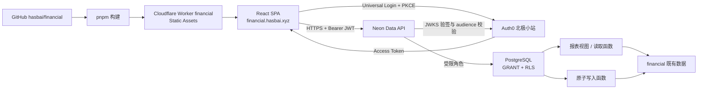

# 技术架构与接入方案

状态：拟采用；平台能力已查官方文档，当前服务配置见 [现场核查](BASELINE.md)。

## 1. 纯前端方案

推荐首期采用无自建业务 HTTP 后端的架构：静态 SPA 承担交互，Auth0 颁发用户令牌，Neon Data API 校验令牌，PostgreSQL 执行授权、查询和原子业务操作。数据库仍承担后端责任。

Neon 官方支持浏览器直连、外部 JWT 和 PostgREST 兼容调用；当前官方页面标记 Data API 为 Beta。首期需用真实 JWT 验证兼容性，并把访问封装在一层 repository 中，便于必要时切换到 Worker API。[Neon 概览](https://neon.com/docs/data-api/overview)

| 能力 | 承担位置 |
| --- | --- |
| 登录、交互、表单即时校验 | React + Auth0 SDK |
| 数据权限、账本成员、不可伪造的操作者 | PostgreSQL RLS / 受限函数 |
| 金额、借贷平衡、幂等、原子保存、版本检查 | PostgreSQL FUNCTION |
| 聚合、期初/期末、过滤、完整性统计 | SQL 视图和只读函数 |
| 静态文件、SPA 深链接、域名、缓存头 | Cloudflare Workers Static Assets |
| 外部银行凭据、付费行情密钥、Webhook、异步大导入 | 后续 Worker API/异步任务 |

PostgREST `/rpc` 暴露 `FUNCTION`，不支持直接调用 `CREATE PROCEDURE ... CALL`。写入函数用 POST，在一次数据库事务里完成交易、分录、审计与幂等记录。[PostgREST RPC](https://docs.postgrest.org/en/stable/references/api/functions.html)

## 2. 开源选型

下表为拟引入依赖，不代表已经安装。P3 安装时核实稳定版本、React peer dependencies 与许可证，提交锁文件；不在规划中绑定未经实测的最新版组合。

| 用途 | 选择 | 使用范围 |
| --- | --- | --- |
| 应用/构建 | React、TypeScript、Vite | 单一 SPA，无 SSR 框架 |
| UI | `@mui/material`、`@mui/icons-material`、Emotion | Card、Dialog、Drawer、Autocomplete、FAB、Snackbar、主题 |
| 路由 | React Router | 总览、流水、详情、编辑和 Auth0 callback |
| 服务端状态 | `@tanstack/react-query` | 分页缓存、取消请求、保存后失效刷新 |
| 表单 | React Hook Form、Zod | 字段校验、dirty 状态、分录编辑 |
| API | `@neondatabase/postgrest-js` | 单独使用 PostgREST 客户端，登录由 Auth0 管理 |
| 图表 | Recharts | 轻量趋势/分类图；主题色和无障碍摘要 |
| 金额与日期 | decimal.js、date-fns / Intl | 十进制表单运算、时区显示；权威聚合在 SQL |
| 动效 | MUI/CSS transitions，按需 Motion | Sheet、确认状态、卡片切换；避免两套过渡叠加 |
| 校验 | Vitest、Testing Library、Playwright、axe-core | 业务边界、交互流程和可访问性 |
| 包管理/发布 | pnpm、Git/GitHub、Wrangler | 可复现构建、提交记录、Cloudflare 发布 |

MUI 是开源 React Material Design 组件库，官方仍说明基础设计支持 Material Design 2；本项目采用其组件并定制现代 Material 风格，不承诺直接获得完整 M3。免费组件足够完成首期，不引入 MUI X Pro/Premium 或付费模板。[MUI](https://mui.com/material-ui/getting-started/)、[MUI X 分层](https://mui.com/x/introduction/)

## 3. Auth0 接入

优先复用用户指定的“北极小站” application。当前本地登记 tenant 为 `hasbai.eu.auth0.com`，CLI 会话过期，application 尚未核实。

拟配置：SPA public client、Authorization Code + PKCE、Universal Login，前端使用 `@auth0/auth0-react`；获取带业务 API audience 的 **Access Token**，不把 ID Token 当作业务授权凭证。[Auth0 React SDK](https://auth0.com/docs/libraries/auth0-react)

| 设置 | 目标值/规则 |
| --- | --- |
| Callback URLs | `https://financial.hasbai.xyz/auth/callback`；开发 `http://localhost:5173/auth/callback` |
| Allowed Logout URLs | `https://financial.hasbai.xyz`；开发 `http://localhost:5173` |
| Allowed Web Origins | 上述两个 origin；生产不允许通配预览域名 |
| Audience | 拟建/复用 `https://financial.hasbai.xyz/api` 对应的 API Identifier；它是令牌资源标识，不要求真实存在该 HTTP 路径 |
| Signing | 优先 RS256，确认现有应用及 API 配置 |
| JWKS | 若实际 issuer 为该 tenant，则使用 `https://hasbai.eu.auth0.com/.well-known/jwks.json`；自定义域名需按实际 issuer 核对 |
| 缓存 | SDK 内存缓存；首期不持久化 token 或财务响应到 localStorage |
| 会话 | 需要续期时配置 Refresh Token Rotation；遇到需重新交互登录时明确提示，不无限重试 |

对已有 application 的 URL 列表使用增量合并，保留原站配置。如其类型不是 SPA 或客户端安全设置与 SPA 冲突，先评估单独 financial SPA client 并复用 tenant 的 SSO，不能直接更改类型破坏原站。

Neon 配置外部 JWKS 与明确的 JWT audience。当前 endpoint 的配置响应没有返回 provider，必须再核实；官方说明一次配置一个 provider，更换会影响原有 token。共享 endpoint 已暴露 `public` 和 `financial`，变更前检查既有应用。[外部身份配置](https://neon.com/docs/data-api/custom-authentication-providers)、[Data API 管理](https://neon.com/docs/data-api/manage)

P1 必测 issuer、audience、签名、过期和有效 `sub`；包括其他合法签名但不属于本应用的 token。如果现有 Data API 无法可靠约束所需 issuer/audience/角色，则采用 Worker 验证 JWT 后调用受限数据库函数，不在前端放宽验证。

## 4. 数据授权与访问层

建议业务数据继续在 `financial`，新增 `financial_api` 专门容纳对外视图与 RPC。确认旧消费者后，只从 API 暴露必要的门面；撤下 `financial` 的 REST 暴露是后续有影响的配置变更，不能本轮自动执行。现有 `public` 暴露范围也不擅自变更。

授权模型、视图安全和受限写入角色见 [DATABASE](DATABASE.md)。Neon Data API 的授权依靠 PostgreSQL GRANT 和 RLS，前端 `.eq(user_id)` 只属于筛选。[权限模型](https://neon.com/docs/data-api/access-control)

前端建议依赖方向：页面 → feature hooks → repository → PostgREST client。组件不散落拼 REST 字符串，不发送 SQL。每次请求通过 SDK 取得有效 token，缓存 key 包含当前身份与账本；退出清除所有查询和编辑内存，切换身份时销毁旧 client。

只在浏览器发布以下公开配置：Auth0 domain/client ID/audience、Data API URL、API schema。数据库连接串、Neon API key 和 Auth0 client secret 不进入 Vite `VITE_*`。日志保留请求标识、耗时和错误类别，不记录 token、备注、商户或账户明细。

## 5. Cloudflare 与交付

Worker 命名 `financial`，以 Static Assets 承载 `dist`，配置 `assets.not_found_handling = "single-page-application"`，使站内深链接与登录 callback 刷新可达。仅静态托管阶段不需要业务 Worker handler。[SPA 托管](https://developers.cloudflare.com/workers/static-assets/routing/single-page-application/)

拟将 `financial.hasbai.xyz` 设为 Worker Custom Domain。先读现有 DNS/路由再变更，当前域名返回 Caddy 502 并不证明 Cloudflare 配置状态。[Custom Domains](https://developers.cloudflare.com/workers/configuration/routing/custom-domains/)

静态 hash 资源长缓存，HTML 使用重新验证策略；登录 token 和业务 JSON 不进入 CDN 或 Service Worker 持久缓存。配置 CSP、frame-ancestors、Referrer-Policy；CSP 的 connect-src 精确包含所用 Auth0 与 Data API 主机，并按 SDK 实际需求测试 worker-src。生产 CORS 限定业务 origin，CORS 本身不作为数据授权。[Static Assets](https://developers.cloudflare.com/workers/static-assets/)

若启用 `/api/*`，显式让这些路由优先进入 Worker，保证 API 错误返回 JSON 而不是 SPA HTML。

P3 建 CI：pnpm frozen lockfile 安装、lint/typecheck、测试、构建。P6 再连接 Workers Builds 到 GitHub 主分支或采用受控发布工作流，选择一种部署入口。数据库先做兼容性增量迁移，再发布前端；回滚优先回退 Worker 版本，保留可兼容旧前端的数据库结构，不以删表回滚。
