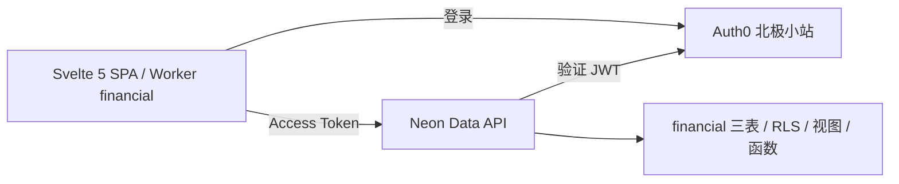

# 技术架构

Svelte 5 + TypeScript + Vite SPA，Bits UI + shadcn-svelte（preset `b6sUj31yy`）+ Tailwind CSS 4 + Lucide，pnpm 管理依赖。Cloudflare Worker 只托管静态资源；业务数据直接调用 Neon Data API（PostgREST 兼容），业务读取视图与保存函数统一在 `financial`。

## 接入

- Auth0 tenant：hasbai.eu.auth0.com。
- 北极小站：SPA，公开 client ID `mdmD7xvX5yay52SRVZeuIOhGHIa0Wdl2`。
- Audience：`https://financial.hasbai.xyz/api`，RS256，Access Token 有效期一小时。
- Callback：`https://financial.hasbai.xyz/auth/callback`、`http://localhost:5173/auth/callback`。
- Logout / Web Origins：上述两个 origin。
- `@auth0/auth0-spa-js` 官方 SPA SDK 使用 Authorization Code + PKCE，token 仅在内存；每次请求调用 getTokenSilently，退出清除查询缓存。生产代码不处理密码。
- 单人身份由用户确认的 Auth0 sub 限定，数据库同时校验 issuer/audience。

Neon 项目 `mute-king-39794724` / neondb。开发分支 `br-proud-bread-b3hl3asf`，production 分支 `br-billowing-violet-b3pkbm3s`。公开的前端配置见 src/lib/config.ts；默认使用生产 endpoint，测试可通过 VITE_DATA_API_URL 替换目标 endpoint。

Data API 的 JWT 校验发生在 Neon，PostgreSQL 再限制本人行访问。纯前端不意味着允许公开访问数据库。[Neon 外部身份支持](https://neon.com/docs/data-api/custom-authentication-providers)

## 应用结构

- `src/pages`：总览、流水、编辑、科目。
- `src/lib/api.ts`：集中封装 PostgREST 调用，自动取得 Auth0 token。流水及三类报表直接 GET 视图，筛选、分组、金额求和均在 PostgreSQL；只有保存交易/科目使用 RPC。
- `@tanstack/svelte-query`：通过 Svelte 5 accessor 查询缓存、游标分页与保存后刷新。
- Svelte 5 runes：编辑状态与分录数组；快照提交，原分录 ID 和 updated_at 保留。
- Decimal.js + SQL numeric：金额输入与计算。
- Svelte SVG：趋势展示及逐日可访问明细；坐标用 Number，仅用于呈现，权威金额来自 SQL。

- `src/lib/auth.svelte.ts`：Auth0 初始化、回调、登录/退出及取 Access Token，SDK 按需加载。
- `src/lib/router.svelte.ts`：History API 路由、查询字符串、返回与未保存提醒；保持原 SPA 路径。
- `src/lib/context.ts`：Svelte context 注入 Repository；测试注入替身，不加入生产绕过认证开关。
- `src/lib/editor.ts`：表单初始化和退款分录输入；SQL 负责最终保存校验。
- `svelte-check` 同时检查 Svelte 与 TypeScript；TypeScript 6 是当前 svelte-check 声明支持的主版本。

## 发布

`wrangler.jsonc` 配置 Worker financial、dist 静态目录、single-page-application 回退与 financial.hasbai.xyz 自定义域名。`public/_headers` 配置缓存、安全头。`pnpm build` 后用 Wrangler 发布。

GitHub Actions 进行 frozen-lockfile 安装、typecheck、test、build。未设置自动生产数据库迁移。视图客户端发布前必须先在生产执行 `003_read_views.sql`；该迁移兼容旧客户端，可按数据库迁移、API验收、Worker发布的顺序交付。生产发布状态单独记录在 [PROGRESS](PROGRESS.md)。

回滚优先退回 Worker 版本；数据库不新增字段、不删除原数据。共享 Neon endpoint 的 provider 配置修改前必须核查原消费者；不调整其他 Auth0 application。

## 程序化验证

按用户要求，本地 `.env` 保存 AUTH0_TEST_EMAIL / AUTH0_TEST_PASSWORD，权限600且被Git忽略，不进入构建。`scripts/auth0-token.mjs` 只供本机检查：通过 Auth0 Universal Login 正常账号页/密码页、Cookie 会话、Authorization Code + PKCE 获取本人 Access Token。无需 Auth0 CLI 管理登录、client secret 或临时修改 grant；不改写 `.env`。授权回调严格校验 state，凭据仅提交同一 Auth0 origin，遇 MFA/CAPTCHA 等额外验证时明确停止。生产 SPA 继续使用官方 SDK，测试脚本不进入浏览器。

实测 Neon 对错误 audience 的签名有效令牌未直接返回HTTP错误，因此由 financial.is_owner() 的 audience 检查与 RLS 拒绝业务数据访问；不能把配置 jwt_audience 当作已生效的网关校验。正式应用仍使用 Auth0 SDK 的 PKCE。
