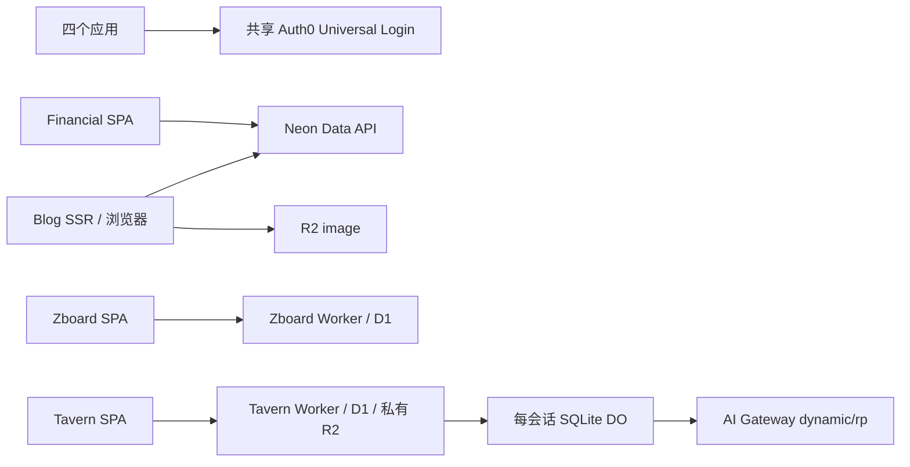

# Monorepo 架构

Hasbai 使用 pnpm workspace；`apps/*` 是独立应用，`packages/*` 提供共享能力。仓库名 `financial` 为历史名称。业务 repository、主题和存储契约留在对应应用，不用财务边界约束其他应用。

## 应用与数据流

| 应用 | 前端 / Worker | 业务存储与调用 |
| --- | --- | --- |
| [Financial](financial/ARCHITECTURE.md) | Svelte 5 / Vite SPA；Worker `financial` 托管静态资源 | 浏览器直连 Neon Data API，`financial` 三表、报表视图及写函数 |
| [Blog](blog/ARCHITECTURE.md) | SvelteKit SSR；Worker `blog`，`hasbai.xyz` / `blog.hasbai.xyz` | 公开内容由 SSR/浏览器直读 Neon Data API，业务表在 `public`；R2 `image` 存公开图片 |
| [Zboard](zboard/ARCHITECTURE.md) | Svelte 5 / Vite SPA；Worker `zboard` | Worker 验签、D1 用户/节点/模板/报告、订阅与 Node API |
| [Tavern](tavern/ARCHITECTURE.md) | Svelte 5 / Vite SPA；Worker `tavern` | D1 目录/角色/世界书/设置；每会话 SQLite DO 保存正文与状态；私有 R2；AI Gateway `dynamic/rp` |

```mermaid
flowchart LR
  Apps[四个应用] --> Auth[共享 Auth0 Universal Login]
  Financial[Financial SPA] --> Neon[Neon Data API]
  Blog[Blog SSR / 浏览器] --> Neon
  Blog --> Image[R2 image]
  Zboard[Zboard SPA] --> ZWorker[Zboard Worker / D1]
  Tavern[Tavern SPA] --> TWorker[Tavern Worker / D1 / 私有 R2]
  TWorker --> DO[每会话 SQLite DO]
  DO --> Gateway[AI Gateway dynamic/rp]
```

签名、有效期、audience 和授权执行点见[AUTHORIZATION](AUTHORIZATION.md)；Neon 数据库角色权限与 Worker owner 隔离各自承担业务授权。

## 共享包

| 包 | 职责 | 不包含 |
| --- | --- | --- |
| `packages/ui` | Luma primitives、通知、可复用交互组件 | 应用报表或业务权限 |
| `packages/auth` | SDK 工厂、公开配置、公共 claims 与 permission helper | 密码、管理凭据、逐轮用户资料查询 |
| `packages/data` | Neon PostgREST 客户端工厂 | 应用 repository 和业务读取包装视图 |
| `packages/markdown` | 安全 Markdown 渲染与阅读组件、数学/引用/图表扩展 | 内容自动改写或发布决策 |

视觉与复用要求见[DESIGN](DESIGN.md)。根脚本默认代理财务；财务源码、原脚本与视觉清单中的相对路径以 `apps/financial` 为工作目录，CI 等待脚本位于根 `scripts/wait-ci.mjs`。

## 自动构建与运行入口

Cloudflare Workers Builds 监听 `main` 自动构建发布。当前 Git remote 为 `hasbai/hasbai`；2026-10-10 只读回查的 Cloudflare repo_connection 名称仍为历史 `hasbai/financial`，交付时按实际 Build 提交核对，不单凭显示名称判断同步结果。仓库根 `wrangler.jsonc` 保留财务静态入口兼容；各应用也有独立 Wrangler 配置。GitHub Actions 不部署。

| 应用 | 已登记构建入口 | 配置与版本核验入口 |
| --- | --- | --- |
| Financial | 应用根 `apps/financial`；`pnpm build` | `apps/financial/wrangler.jsonc`；线上 HTML / 静态资源与构建产物核对 |
| Blog | 应用根 `apps/blog`；`pnpm build`，含 workerd 启动检查 | `apps/blog/wrangler.jsonc`；`/api/version`、SSR |
| Zboard | 仓库根；`pnpm --filter zboard build` | `apps/zboard/wrangler.jsonc`；Worker 版本及线上资源 |
| Tavern | 仓库根；`pnpm --filter tavern build` | `apps/tavern/wrangler.jsonc`；`/health` 与部署版本 |

2026-10-10 回读的过滤：财务 `apps/financial/*`、博客 `apps/blog/*`，均包含 `packages/*` 和根 workspace/lockfile；Tavern 为 `apps/tavern/**`、`packages/**` 和根 workspace/lockfile；Zboard 当前为 `*`（全仓库），并非只监控应用路径。此次仅记录现状，不修改后台触发器。自动 Build SHA 与线上版本在交付时核对。Tavern/Zboard 本地前端通过 Vite 代理独立 Worker API；细节见应用架构。发布、数据库兼容步骤和回滚验证的执行要求统一见[TESTING](TESTING.md)。
