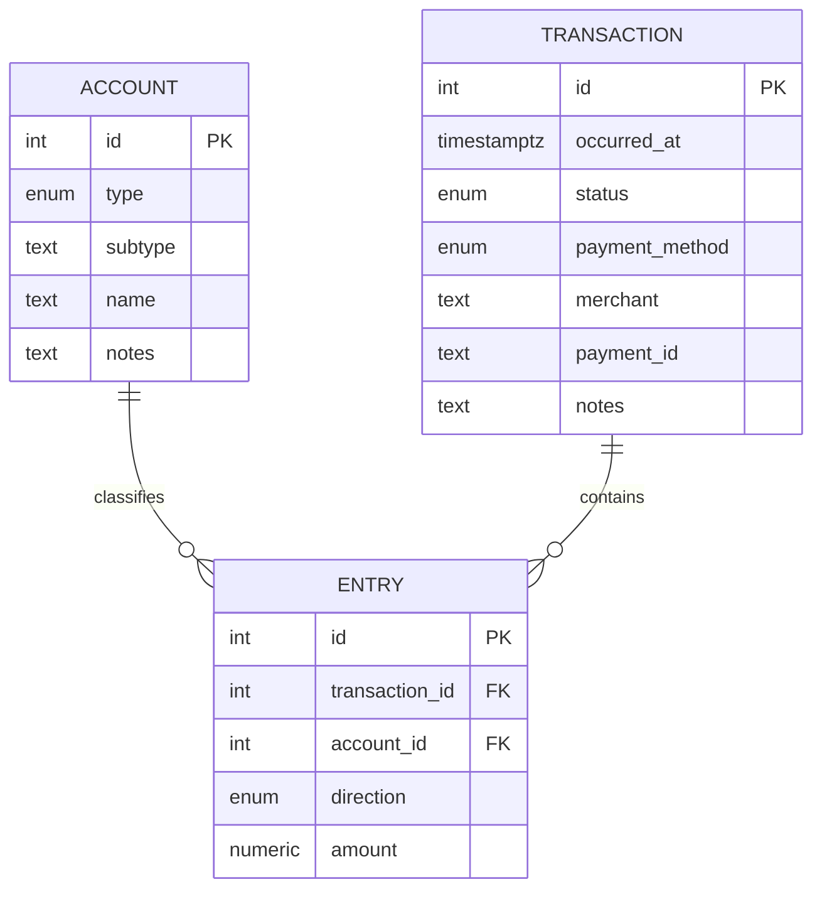

# 数据库、授权与 API 契约

状态：既有结构已核查，以下新增对象全部为设计草案，未执行 DDL 或迁移。实际基线见 [BASELINE](BASELINE.md)。

## 1. 保留的模型



现有 `entry.account_id` 可空，适合表达待匹配；但不满足正式入账。`transaction` 没有金额字段，无分录交易无法从现有模型取得金额。现有 `get_accounts()` 返回按类型/子类/显示名聚合的 JSON，可供旧消费者继续使用；新 UI 使用按 ID 返回的扁平科目列表，避免重名键覆盖和难以过滤。

## 2. 增量对象草案

| 对象 | 拟变更 | 目的 |
| --- | --- | --- |
| `financial.ledger` | 新增账本、base_currency、timezone、opening_date | 首期单账本，保留扩展空间 |
| `financial.ledger_member` | 新增 `(ledger_id, auth_subject)`、role、active | 显式绑定 Auth0 `sub`，业务授权 |
| `financial.account` | 新增 ledger_id、is_active、is_cash_equivalent | 账本隔离、科目停用、现金范围 |
| `financial.transaction` | 新增 ledger_id、posting_state、version、kind、currency、source、refund_of_transaction_id、reversal_of_transaction_id、posted_at | 来源与入账分离，并发/退款/冲销关系 |
| `financial.entry` | 新增 ledger_id；保留原 PK、方向与金额 | 同账本复合 FK 与 RLS，保留历史关联 |
| `financial.transaction_draft` | 交易草稿结构化 payload、version | 保存尚不平衡或金额未知的输入，不污染已入账分录 |
| `financial.cashflow_allocation` | transaction_id、ledger_id、方向、金额、用途、对应现金科目/分录 | 复杂交易毛流量拆分，与净现金变化勾稽 |
| `financial.mutation_request` | 主体、账本、幂等键、payload hash、结果引用 | 并发重试只执行一次 |
| `financial.audit_event` | 主体、时间、实体、动作、前后差异/版本 | 私有审计，记录修订，排除 token |
| `financial_api.*` | 明确列出的视图与函数 | 稳定、最小的对外接口 |

数据表和外键变更都先在隔离分支试验。身份绑定由受控迁移设置，历史数据不得按“第一个登录的人”自动归属。

`ledger_id` 从交易/科目关系回填并验证后再加 NOT NULL；用 `(ledger_id,id)` 唯一键与复合 FK 阻止跨账本分录、退款和现金分配关联。保留已有 identity，不使用 `max(id)+1` 新建 ID；仅在有显式历史导入需求时检查并校准序列。

现有删除科目会 SET NULL、删除交易会 CASCADE：先保留兼容性并禁止 API 硬删除，改用停用/冲销。后续如调整 FK 删除策略，独立验证既有写入程序。

## 3. 权限设计

首期仍做账本授权，即使只有一个用户。验证 Auth0 `sub` 后，通过 active 的 ledger_member 判断访问权；角色为读者/编辑者/所有者，页面按钮仅辅助，真实规则在 DB。

| 数据库角色 | 权限 |
| --- | --- |
| `anonymous` / PUBLIC | 无业务 schema 访问、无业务表读写、无公开写 RPC |
| `authenticated` | 使用 API schema；读取安全视图；为 invoker 视图授予必需的基表 SELECT，并通过 RLS 限行；只执行列入清单的写 RPC，无基表 DML |
| 专用函数 owner（拟建 NOLOGIN） | 仅所需业务 DML、非超级用户、无 BYPASSRLS，不拥有业务表；不授予客户端角色成员身份 |
| 迁移角色 | DDL 权限，仅受控迁移使用，不进入浏览器 |

所有包含账本数据的基表启用 RLS，SELECT 与写入策略同时核对身份、账本和权限；引用的成员表避免递归策略。成员表客户端只能读自己的必要字段，客户端不可自行加入或提权。禁止无身份的“默认本人”兜底。

读取视图设 `security_invoker=true`，使底层 RLS 以调用者生效；聚合也只能作用于已授权行。不要使用默认 owner 权限视图绕过 RLS；物化视图不是首期必需。[PostgreSQL 视图安全](https://www.postgresql.org/docs/current/sql-createview.html)

写入使用精简的 SECURITY DEFINER 函数，由上述受限 owner 执行，以支持客户端无基表写权限。函数开始显式校验当前 JWT 身份和账本成员，再检查关联对象归属；RLS 作为第二层约束并为受限 owner 定义相应策略。固定安全 search_path（如 pg_catalog 并全限定业务表名），不拼接动态 SQL，不接受可执行 SQL 或数据库角色参数。

在同一迁移事务中先撤销 PUBLIC 对函数的 EXECUTE，再精确授予所需签名；设置新函数的默认权限。尤其 `get_accounts()` 当前有默认 EXECUTE，未来授予 schema USAGE 时必须一并复核。API JWT role 不允许映射到 owner/超级用户；默认 authenticated 映射需要用真实 Auth0 token 实测。

`financial_api` 暴露之后，基表 `financial` 可在确认旧消费者兼容后从 REST 暴露列表撤下，但仍保留 PostgreSQL schema。如果暂时保留暴露，RLS 和基表无 DML 必须一样成立。不能用“隐藏端点”替代授权。

## 4. 读取契约草案

以下名称均未创建。默认 schema 为 `financial_api`；跨 schema 请求由客户端 schema 设置处理，GET/HEAD 使用 Accept-Profile，写入方法使用 Content-Profile。[PostgREST schemas](https://docs.postgrest.org/en/stable/references/api/schemas.html)

| 对象 | 参数/输出 |
| --- | --- |
| `v_accounts` | id、type/subtype/name、active、cash 标志；不返回私密审计信息 |
| `list_transactions_v1` | ledger、期间、搜索、科目/渠道/状态/质量过滤、cursor、limit；返回 items、next_cursor、质量计数 |
| `get_transaction_v1` | transaction_id；返回交易头、entries、草稿、缺失字段、version、退款/冲销关系 |
| `get_overview_v1` | ledger、period_start、period_end、as_of；一次快照返回三表汇总、趋势、完整性与覆盖范围 |
| `v_posted_entries` | 内部统一报表集合，包含有效原分录和冲销分录，精确规则按 DOMAIN |

列表 `(occurred_at DESC,id DESC)` 游标排序，限制最大 100 笔。复合过滤在数据库执行；补录待处理计数与列表筛选口径一致。当前 API 上限 1000 行，不能下载第一页后在浏览器算总账。

金额对外显式 `numeric::text`，避免 JSON 数字进入 JS 后精度丢失；未知金额 `null`。报表输出独立的 quality 对象，至少含缺分录数、缺科目数、待确认退款数、期初完整性、覆盖起点、排除原因和生成时间。不要把无法计算的数值转成零。

## 5. 写入契约草案

| RPC | 职责 |
| --- | --- |
| `save_transaction_draft_v1` | 新增/保存不完整表单与元信息，不触碰已入账事实 |
| `post_transaction_v1` | 从完整草稿生成/修订交易分录，平衡检查，入账，写审计 |
| `match_entry_account_v1` | 匹配科目、检查账户归属/停用状态；若影响已入账交易，走修订规则 |
| `refund_transaction_v1` | 新建退款并关联原交易，核对并发累计退款 |
| `reverse_transaction_v1` | 保留原交易，生成反向分录并关联，防止重复冲销 |
| `save_account_v1` | 新建/编辑/停用科目，禁止改变历史科目类型造成报表重分类而不留痕 |

所有写函数统一参数包含 `p_request_id`（UUID）、目标 ID、`p_expected_version`（已有记录必填）、白名单 payload。调用者身份只能从已验证会话读取，payload 不接受 owner、posted_by、角色或审计操作者。

```json
{
  "p_request_id": "11111111-1111-4111-8111-111111111111",
  "p_transaction_id": 123,
  "p_expected_version": 7,
  "p_payload": {
    "occurred_at": "2026-09-13T04:30:00Z",
    "entries": [
      {"direction": "借", "account_id": 10, "amount": "68.00"},
      {"direction": "贷", "account_id": 20, "amount": "68.00"}
    ]
  }
}
```

示例 ID 与金额均虚构。一次事务：验证身份 → 幂等唯一键/锁 → 检查 payload hash → 锁目标记录与相关退款源 → 检查 version → 字段/关联/金额/借贷/现金流验证 → 交易、分录和审计写入 → 版本递增 → 保存幂等结果。任一步失败全部回滚。

唯一范围为 `(auth_subject,ledger_id,request_id)`。同键同 payload 返回首次结果；同键不同 payload 返回冲突。请求超时后必须复用原键重试，不能生成新键重复记账。

基础表约束保底：amount > 0、必需外键；跨行借贷平衡用写函数加延迟约束触发器验证“已入账”交易（INSERT/UPDATE/DELETE 均覆盖），避免其他导入入口绕过规则。草稿允许缺项，入账验证不可放宽。

错误返回保留 PostgREST 的 `code/message/details/hint` 结构，再由前端映射中文业务提示。拟定义 VALIDATION、VERSION_CONFLICT、IDEMPOTENCY_CONFLICT、ACCOUNT_INACTIVE、FORBIDDEN；HTTP 状态映射和 SQLSTATE 在 P1 实测，不假设客户端总收到 401（当前无 token 实测为 400）。

## 6. 迁移与性能验证

迁移按：备份/分支 → 只读基线 → 增加 nullable 字段和新表 → 校准身份、币种、期初和退款 → 回填并核对 → 加约束/RLS → 创建 API 门面和 RPC → 权限测试 → 刷新 schema cache → 前端接入。每次记录 SQL、对象差异、行数和业务校验结果。

拟评估 `(ledger_id,occurred_at DESC,id DESC)` 索引及待处理筛选索引；现有分录 transaction/account 外键索引已在。小数据规模先用普通视图/SQL，依据真实 EXPLAIN 和分页耗时再优化。新函数/视图创建后按 Neon 管理接口刷新 schema cache；更新 settings 前读取完整配置，避免替换语义重置既有字段。[Neon 管理说明](https://neon.com/docs/data-api/manage)
