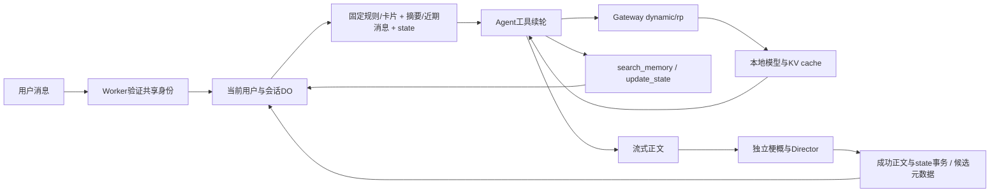

# Tavern Agent：长期方案与当前优先级

## 当前 Director 约定（2026-10-04）

用户最新要求替代下文历史“完整请求前缀/逐行补缺”约定：独立 Director 只读取核心角色卡、会话系统故事约束、persona、整体剧情梗概、本轮最新状态和最近四条纯剧情。梗概独立持久缓存、按版本校验并增量更新，窗口外剧情不遗漏；超限只压缩 Director 局部投影，不截字、不修改正文 checkpoint。输出经严格 JSON Schema 限制为恰三个 choices，全部有效才提交；无效或 length 保留正常正文、空候选。工具、原请求投影和完整历史不进入 Director。详细输入、缓存和失败契约见 [模型设置与候选](TAVERN-MODEL-SETTINGS.md#正文结束后的-director-agent2026-10-04)。下文旧轮次的方案与实测保留为历史记录。

2026-10-04。目标：有状态、长期记忆、多轮工具推理的角色Agent，优先适配32K且prefill/decode慢的本地模型。本批实现state快照、原生工具续轮、会话记忆、持久模型投影和世界书检索；发布及真实应用验收见交付状态。

代码入口为主分支`apps/tavern`。保留现有数据和ID、角色卡、共享认证、候选、流式正文、停止、续写、重新生成、编辑分支和导出。

## Agent 实施契约（2026-10-04）

- 每个assistant版本保存before/after状态与工具步骤。scene、facts、relationships、inventory采用有界JSON patch，省略保留，null删除。状态只在正文正常完成且整回合未被停止时，与消息/revision在DO事务内提交；候选故障保留正常正文状态。
- 重生成与中断续写从对应版本before开始；失败版本保持可见，但Prompt/state/记忆共用最新成功剧情版本。分支仅复制编辑点之前的成功状态，重映射消息锚点，排除编辑点旧after与工具步骤。D1兼容迁移0008保存分支seed，惰性导入失败仍可恢复。
- 真实RP原生tools往返已先验证。search_memory返回最多三条会话原文/世界书短记录及版本来源；update_state只暂存已发生事实。不接受URL、SQL、owner或session参数。工具与结果按实际顺序追加；重复调用或连续无新检索证据结束，无硬轮数、正文总输出量或整轮deadline。
- 正文仍流式输出，工具协议/reasoning独立解析。length自动继续；仅在超过发现窗口或明确超限后压缩，超长工具辅助正文只压缩模型投影，持久正文不裁剪。候选由独立 Director 读取剧情数据，不携带正文前缀、tools 或 tool_choice，绝不执行未来行动。
- DO仅保留最新可复用模型投影，来源版本/正文/角色/设置/书版本与当前system均校验；普通下一轮追加已发送提醒与新状态/输入，候选不进入持久投影。压缩、角色/世界书激活变化和编辑使投影失效。正文不每轮摘要，也不额外请求token计数；Director窗口外梗概独立增量维护。
- 世界书仍保留既有关键词/常驻机制；按需search_memory另检索已绑定启用条目。DO内分块绑定book/entry/content hash，移除未绑定或旧版本。每次最多新增8块向量、总检索10秒，渐进补齐；向量不可用回退真实关键词结果，外层停止立即退出。固定`@cf/baai/bge-m3`仅用于检索嵌入，通过既有Gateway/AI绑定与三项归属日志，不新增秘钥、向量服务或浏览器模型入口。
- 当前模型服务实测一个slot、运行32768。复用上游有限slot调度，真实并发/取消/切回与KV指标分别验收；不为单slot创建无收益的独立会话亲和，不承诺全部历史必然缓存命中。

依据：[DO SQLite](https://developers.cloudflare.com/durable-objects/api/sqlite-storage-api/)、[Workers AI Gateway binding](https://developers.cloudflare.com/ai-gateway/usage/worker-binding-methods/)、[BGE-M3](https://developers.cloudflare.com/workers-ai/models/bge-m3/)。后续embedding扩展长期会话记忆、精确tokenizer或多slot亲和均以实际收益为前提，不是本批额外服务依赖。

## 架构对照与迭代（2026-10-04）

本轮追加用户要求：删除会话时同时清理对应DO存储/实例生命周期；不能只隐藏会话并永久保留DO tombstone。真实验收还发现短来源梗概因套用压缩的缩短条件而拒绝，需区分梗概构建与上下文缩容。实施与验收契约见下文及模型设置文档；PR54混合检索的已交付证据见交付状态。

主参考为 [flizzywine/dsh-tavern 架构](https://github.com/flizzywine/dsh-tavern/blob/f9d6ab0842f61af97a48efee113cd89792b28220/docs/architecture.md)，固定提交 `f9d6ab0842f61af97a48efee113cd89792b28220`；补充参考 [NextTavern 检索](https://github.com/a86582751/dsh-nexttavern/blob/b497ecfaafea92b25622e59b0b5b49e1905bceaf/src/memory/memory-retrieval.ts)与[来源校验](https://github.com/a86582751/dsh-nexttavern/blob/b497ecfaafea92b25622e59b0b5b49e1905bceaf/src/memory/memory-provenance.ts)，固定提交 `b497ecfaafea92b25622e59b0b5b49e1905bceaf`。参考其设计与源码，不安装插件或复制运行时；上游缓存与速度宣传不作为本项目验收结果。

| 架构能力 | 本项目现状与差距 | 迭代与完成条件 |
| --- | --- | --- |
| 正文、后台任务、确定性存储分工 | 正文 Agent、独立 Director、DO 原子提交已具备；状态仍由正文原生工具暂存 | 保持正文、状态、候选协议隔离。后台独立状态结算会改变提交语义，先验证遗漏状态的实际样本及额外等待，再单独设计 |
| 按需检索原文 | 成功剧情版本与启用世界书已有关键词/向量召回；原合并先取三条历史，可能完全丢弃世界书 | 本轮修复跨来源选择、来源去重与证据守卫；三条历史命中不挤掉全部世界书，已召回的最新更正保留 |
| 工具执行边界 | 原参数与重复校验晚于世界书索引/embedding | 本轮在外部检索前整批纯校验；非法字段、重复调用与批内重复均不触发检索，合法工具顺序与取消不变 |
| 搜索后按锚点继续读取 | 目前最多三条短片段，没有按锚点读取相邻完整轮次 | 下一优先收集片段不足的真实样本，再评估只读 `read_memory`；只读当前分支成功版本，禁止任意会话/URL/SQL，保留来源与取消 |
| 派生任务独立恢复 | Director 故障保留成功正文，但不能只重试候选 | 有明确候选失败样本后设计单阶段重试；绑定回复/正文指纹/版本，停止和重生成使迟到结果失效，不重写正文、不自动重复模型请求 |
| 上下文与缓存 | 持久正文投影、低频超限摘要、Director 梗概已上线；单 slot 跨轮缓存回退仍是实测局限 | 对照真实 TTFT/prefill/cached tokens 与服务 checkpoint，再决定调度优化；不为缓存改写剧情或承诺上游宣传值 |

权威剧情与状态来自每会话 DO 的成功消息版本和状态事务；摘要、Director 梗概、正文模型投影、世界书分块与向量均为带来源版本的派生数据，可以失效或重建，不能反向改写私人原文。D1 保存公共目录、私人角色库、世界书、设置、会话目录/绑定与旧迁移来源，R2 保留私有原件。

本轮混合选择继续最多三条：两源都有结果时，取已选相关历史中按时间最新的两条、最优世界书一条；空缺由可用来源补齐。历史内部仍保持时序，世界书内部仍沿原关键词/向量排序；不直接比较两种分值。身份由 `id + source`（消息锚点或 book/revision/entry）确定，跨来源裸 ID 相同不互相吞掉。此规则避免合并时丢掉已召回的最新更正，不保证关键词召回覆盖所有语义更正。

2026-10-05追加已复现缺陷：同一成功消息前后相隔超过600字的细节，两次不同query召回不同片段，旧进展守卫只按来源身份判断，第二次被误判无进展并中断正文。合并去重仍用`id + source`，回合进展另用`id + source + text`；新片段允许原生工具续轮，不同query返回完全相同片段仍停止，同一query仍在外部检索前拒绝。保留成功版本/分支隔离、三条上限与来源锚点，不增加工具或索引服务。验收包括失败复现、生成协议/落库/UUID回放、真实workerd重启与持久步骤、PR CI和自动发布；真实模型是否按顺序检索两个片段另以Gateway日志核对，不把夹具当真实模型。

同日片段边界复核：完整查询在长消息后部，前部二元词部分命中会抢占片段锚点；Unicode小写扩长后直接用规范化UTF-16索引截原文，可能空片段或拆开emoji。修复为最长已命中词优先、等长取最早命中，将小写字符串索引映回原文Unicode字符，再取前100/总600字符窗口。中文二元词按Unicode字符生成，避免扩展区汉字被切成单字/残代理。普通词分值公式、成功版本排序、三条上限、混合来源分配与工具协议保持；扩展区汉字不再误命中仅一个共享字符。验收覆盖完整/部分词、160字查询、大小写扩长、emoji边界、扩展区汉字、原生工具/导出/回放及workerd重启，线上以临时夹具和Gateway原文核对。

工具辅助压缩复核：同一模型响应可含正文与tool_calls，原实现只标记工具后的length正文为可压缩，未覆盖同次长正文，导致超限后直接失败。按实际已解析剧情比对标记原wire正文（允许CRLF标准化及空白缓冲差异），只压缩剧情部分，调用/参数/结果/顺序保持；包含兼容候选协议或未确认非空协议片段的wire仍不作为剧情摘要源，工具/length/流式超限三入口一致。剧情投影、生成中正文及摘要递归拆分都按Unicode字符减半；单字符不可再拆时报真实无法容纳，避免重试同源或残代理。原文与版本仍完整保存，压缩只是派生模型输入；取消/失败不提交暂存state。本批涵盖同次正文工具、换行、候选隔离、Unicode/递归进展、持久化/回放和workerd窗口压力；生产压力及未诱导样本分别报告。

不新增 Agent 框架、索引服务、硬切历史窗口、模型入口或角色脚本执行。工具 schema 仍只暴露 `search_memory` / `update_state`。本轮交付须通过相关检索/生成检查、固定 Linux 视觉、PR CI、自动发布与真实 JWT/API 链路；未验收层单列，不用架构对照替代运行证据。

## 历史方案与试验

以下三个轮次只解释既有决策与验收，不作为当前候选协议；当前实现以上方 Director 约定及模型设置文档为准。

## 本轮实施：固定两阶段、完整上下文（2026-10-04，实施前修订）

用户已选择正文完成后立即独立生成三条候选，候选继续使用完整上下文。本批按此实施，短候选探索仅保留为试验记录。

- system只保留角色与写作规则，正文任务放末尾user。正文正常stop并保存后，同一回合立即请求三条候选；不再要求正文附带候选。
- 候选从最后一次正文实际发送的messages追加该次新正文和候选user任务；原system、历史、摘要、世界书激活与正文user任务保持逐字不变，避免重建提示词破坏前缀。length续写后只追加最后一次模型输出，不重复此前正文。
- 候选保留完整已选上下文，不人为缩短或换system；超出已发现窗口或明确上游context错误时，才使用现有自动压缩。候选长度中断与补缺继续追加实际请求/输出，按有效新增判断进展，不设硬轮数、输出预算或整轮超时。
- 复核补充：候选步骤只保存在本轮临时消息序列，压缩回退估算包含这些步骤，但摘要来源始终是真实剧情历史；不能将候选行动写成已发生事实。指标明确区分正文stop、候选开始/首字/完成与各阶段最后请求，候选停止也记录终态；超限重建单独计数，不混入原前缀复用结论。
- 正文先落盘，候选流只进入其元数据；沿用同UUID、生成占用、停止与断连、回放和完成事件，不新增设置/表/调度。候选故障或无进展保留正常正文，用户停止仍立即取消；阅读位置不变。
- 验收正常/重生成/显式续写都固定两阶段；逐字段比较候选messages原前缀等于正文实际messages，正文/candidate字节隔离、候选失败/取消/超限/跨请求length、持久化回放与真实workerd；固定Linux视觉、全部CI、自动发布后真实JWT应用路径日志验证实际缓存与候选等待。模型cache计数不足时报告实际值，不宣称每次必然命中。

验收已完成：PR45全部8CI、自动发布与真实JWT应用路径通过；普通/重生成/续写/约16K各两请求三候选，候选原前缀逐字段恒等、正文/候选保存与UUID回放一致。候选额外等待2.8–4.4秒，16K实际cache15951/16026tokens、prefill75tokens约0.69秒。短两样本新增正文未全缓存，不承诺必然全命中；停止真实验收为正文流中停止，候选阶段停止仅自动化覆盖。state/工具仍未实施。详见TAVERN-PROGRESS.md。

## 本轮试验：正文与候选始终分开生成（2026-10-04，实施前修订）

用户提出评估固定两阶段生成。先做真实模型延迟对比，本轮不先切换生产行为。

- 正文单独完成，再顺序请求三条候选；仍用dynamic/rp和当前采样/关闭思考参数，不加输出硬限。
- 固定system只保留角色与写作规则，正文-only与候选指令均放相应最后user，尽量复用稳定前缀。主对照完成后才另测短上下文，避免探索请求改变主对照slot/cache状态；保留角色、摘要、当前用户与完整新正文，不为提速截断新正文。
- 使用短会话、较长历史两类中性夹具；正文按正常300–600字规则生成，与现有内联候选交错对比，不只测两句正文。
- 分别记录首正文、正文完成、候选额外首字/完成等待、总耗时、实际输入/缓存tokens及prefill/decode；候选必须真实三条且协议不混入正文。按Gateway事件关联完整请求响应，不把回复缓存当KV命中。
- 初测实际长输入约8K而非预期窗口一半，追加约16K样本；候选热前缀测完后，插入一个不同的候选请求再重复完整候选，模拟单slot受干扰，不清空或修改服务缓存配置。保留超出300–600字的异常正文，不混入主配对总耗时结论。
- 已完成19次真实请求：独立候选9/9为三条；完整上下文热缓存后额外3.4–5.2秒，16K缓存被另一请求打断后19.0秒；短候选输入516–626tokens测得4.8–5.5秒。该试验最初建议短上下文；用户随后明确选择完整上下文，实施决定以上方本轮方案为准。详见[TAVERN-SEPARATE-CANDIDATES-TEST.md](TAVERN-SEPARATE-CANDIDATES-TEST.md)，样本不作为P95或所有场景承诺。

## 本轮优先修复：阅读位置与三条候选（2026-10-04，实施前修订）

先处理用户反馈，再接state/工具闭环。当前main已与origin/main核对一致，保留用户修改的参考项目描述。

- 阅读位置由用户控制：流式增量、候选展开、输入框伸缩和同会话完成刷新不滚到底。切换会话只做一次初始化定位，用户通过滚动阅读新内容；本轮不增加自动跟随状态或新设置。
- 已用真实JWT读取两会话12条已完成模型回复，其中4条无候选；关联四条Gateway完整流均stop且完全没有保留分隔符，确认为模型漏写。先实施按需补齐，不为该样本增加猜测性正文解析；只在已识别的保留分隔符之后解析候选。
- 三条有效且互不重复的候选才算完整。正常已有三条保持一次推理；不足三条则在同一回合按需补齐，只补用户台词/行动，不改写正文。该决定更新此前“任何情况下都不补发候选推理”的约束，代价仅由缺失回合承担。
- 补齐沿用占用、请求ID、用户停止和断连信号；上下文仍按发现窗口自动压缩。不加硬轮数、输出预算或整轮超时，按候选增加判断进展，无进展/错误/取消时退出，保留正文和实际完整性，不填模板凑数。
- 本轮复核补充：补齐使用专门的候选输出协议，不附加正文提醒，进入补齐前先落盘正文。键盘滚动验证等待回到顶部后再固定中段阅读位置，避免把浏览器PageDown平滑运动误判成流式自动滚动。
- 候选补齐失败保留正文completed/stop；用户主动停止仍为aborted/stopped。测试夹具的正常回复补全三条尾部，以免把新的按需补齐行为混入原有停止/缓存竞态断言。日志记录缺失类型与补齐结局，不记录私人正文。
- 后续复核：补齐流在半行输出后发生context超限时，与length一样从中断处续写，保留缺额/已有候选信息；补充压缩无进展退出覆盖。三张移动截图因取消自动滚动产生预期阅读位置变化，审阅后更新；两张桌面1/24像素噪声保留旧基线。
- 验收已完成：88项相关检查、固定Linux桌面/iPhone WebKit28流程84图、PR44全部8CI及自动发布。真实正常/重生成/显式续写/省略候选压力样本均三条、刷新与UUID回放一致；续写实际漏尾后一次candidate-only请求补齐，正文逐字不变。详细记录见TAVERN-PROGRESS.md。本批两项修复已交付，state/工具与世界书RAG仍后续推进。

## 参考结论

- 参考项目是：Deepseek Harness Tarven
- [Cloudflare Durable Objects存储](https://developers.cloudflare.com/durable-objects/best-practices/access-durable-objects-storage/)：每对象私有事务存储，新namespace采用SQLite；[并发控制](https://developers.cloudflare.com/durable-objects/api/state/)不能包住长模型请求。

以上为一手文档研究与本项目设计，未安装或逐行复刻参考项目。用户所说的会话对象对应 **Durable Objects**，它不保存本地GPU的KV cache。

## 当前实现与改进

| 已有 | 问题 | 改进 |
| --- | --- | --- |
| dynamic/rp原生工具续轮 + 两阶段SSE | 上游无进展/错误仍可能中断 | 无工具两请求快路径、工具结果追加与回合取消已交付 |
| DO完整消息/版本/摘要/state/tool steps、UUID、续租占用 | GPU缓存不属于DO | 版本快照、失败回滚、分支来源隔离已交付 |
| 后台/props探测n_ctx | 运行容量会变化，不能写死32K | 按已发现窗口缩放，明确超限才压缩 |
| 保留完整历史、超限摘要checkpoint、最新模型投影 | 世界书激活变化会使投影失效 | 真实token前缀已稳定，跨轮GPU回退未解决 |
| 世界书关键词注入system + 按需RAG | 模型嵌入服务会失败、首次索引渐进完成 | 版本化8块批量、关键词兜底、来源过滤已交付 |
| 已发提醒/工具结果持久模型投影 | 单slot分叉回退可能重做prefill | 同轮cache命中、跨轮cache0均有实测，不改剧情换缓存 |

Gateway仍固定`dynamic/rp`，前端不提交任意URL/上游模型/密钥。`skipCache:true`保留，它禁用回复缓存，与模型KV缓存不同。

## 按优先级推进

已发布短写作规则、两阶段候选、上下文超限压缩、自动续写、每会话DO、state、原生工具、会话记忆与世界书RAG。真实JWT/模型/停止/版本验收通过；模型投影token前缀稳定，同轮KV缓存命中而跨轮仍为0。完整当前证据见TAVERN-PROGRESS.md首节。表中是依赖与能力清单，不是固定七步；后续多slot/长期记忆embedding/精确tokenizer按实际收益推进。

此前会话DO阶段未同时增加state/tools：真实100152字符开场先收到32768上下文超限；旧摘要请求以assistant结尾，模型续写并回送25040字符原文而未完成有效摘要。修订为system规则+带角色标记的user来源后，真实100152字符源压缩为152字，第二轮复用checkpoint、不再总结；462/547实际输入tokens，原文保留。四次摘要没有硬请求轮数截断。该阶段增长两轮KV缓存仍0；同前缀重生成实际复用334/338 tokens。后续state/tools本批已补齐。

| 优先项 | 交付 | 验收 |
| --- | --- | --- |
| **短prompt与自动压缩** | 精炼写作规则、保留已验证候选协议、按发现的容量保留历史、超限摘要、长度结束自动续写、请求缓存复用、首正文/usage/cache时序 | 16K/32K/未知、长卡片、最近完整轮次、续写/重生成、自定义保留、同次候选、真实连续轮次 |
| **每会话DO** | SQLite DO、用户+会话路由、回合占用/取消/UUID、全部会话接口统一、旧会话惰性导入 | 重启、隔离、并发、重复请求、导入失败、ID/版本保留、停止/分支/删除/导出 |
| **state快照** | JSON状态、回合前后快照、摘要来源版本；仅超限自动压缩 | 成功才提交、重生成恢复前态、分支无未来事实、摘要失败不删原文、短聊不多调模型 |
| **最小Agent loop** | search_memory/update_state、工具结果续轮、工具结果追加、无固定轮数/总输出量/运行超时 | 0/1/2工具续轮、原生tools兼容、非法参数、重复调用、无进展停止、取消、正文不泄露协议/思考 |
| **长记忆检索** | 摘要块+原文锚点、会话内关键词/全文检索；后续再加embedding | 旧事实找回、否定更正、出处、中文召回、当前会话/分支隔离、未命中不伪造 |
| **性能与恢复** | 模型投影追加、低频压缩、有限slot亲和、公平调度、断流恢复 | 长聊/切会话cached tokens和TTFT实测、route变化、取消/重启、不盲目重发 |
| **世界书RAG** | 版本化分块、关键词+向量、metadata过滤、有界召回 | 来源/权限、无关条目不注入、召回质量、额外成本/缓存影响 |

自动压缩已增加摘要checkpoint，原消息与版本仍完整保存；不再按固定块删除模型可见历史。state与按需找回、世界书RAG现已补齐，保留现有导入、绑定与关键词功能。

## 最终结构

保持直接的TypeScript模块：prompt、model adapter、tools、agent loop、session storage。当前已用session-object/session-store分开协调与SQLite操作。先不引入通用插件框架或Agents SDK；确有收益再评估。

## 每轮prompt与缓存顺序

逻辑上每次step包含角色卡、state JSON、长期摘要、近期消息、当前输入和实际可执行的工具；按稳定到变化排列：

1. 正文短system：写作规则和工具规则；稳定排序的工具schema。Director另用独立候选system与JSON Schema，不进入正文投影。
2. 角色卡、用户persona、卡片额外约束；不重复抄卡片，不自动改用户自定义。
3. 低频摘要checkpoint，不每轮重写。
4. checkpoint后的完整近期消息，平时追加，不重排。
5. 当前state JSON、必要检索结果、当前用户输入；动态内容靠后，最新快照覆盖旧快照。
6. 本回合assistant tool_calls与对应tool results；冻结基础prompt并追加结果，不每step重拼。

JSON紧凑编码、稳定键序；移除模型无关的锁、revision、更新时间和日志字段。state不放在卡片或长历史之前；空摘要显式为空，不伪造记忆。工具返回是数据，不能改变system或权限。

实际chat template可能把tools渲染在system之前，所以检验最终token前缀，不只比较messages数组。持久模型投影应保留实际发过的应用提醒、工具协议和需要的模板内容；首批仍有世界书变化/最新提醒带来的缓存边界限制，不声称全历史缓存命中。

精炼写作规则：保持角色口吻与已发生事实，只写角色可知的信息，用户决定自己的行动和台词；具体对白/动作推进当前场景，不复述灌水或擅自跳时，保留回应空间。段落/长度随情节，不追加长篇禁词表和强制反思。

## 上下文自动缩放与慢模型优化

2026-10-04按用户批注修订：32K是目前本地模型的运行容量，不是应用硬上限。取消12288输入目标、32768规划钳制、固定历史淘汰、maxTokens字段和总输出额度，也取消最多3次模型请求及整轮deadline。未来发现16K、64K等容量时直接使用真实容量；未知容量保留全部有效历史，不猜窗口。

短会话没有工具/续写/压缩时，正文一次、Director一次；历史完全位于近期窗口时不额外生成梗概。正文估算输入超过已发现容量，或上游明确报上下文超限时，才压缩较早完整轮次；保留当前输入、角色设定和原始消息。摘要请求自身超限或返回length时按时间顺序拆小来源再压缩。摘要只记录已发生事实、关系、否定/更正和未决线索，绑定消息ID与内容指纹；后续平时追加历史，不逐轮改正文摘要。Director窗口外梗概按其独立增量契约维护。

字符估算沿用倍率，加入256 tokens的模板估算量，不预扣总输出预算；优先完善真实tokenizer校准，但不每轮额外计数请求。核心卡片和当前输入单独超过物理容量且无可压缩历史时报告真实错误，不静默修改用户内容。

正文模型返回length时保存并继续同一回复，沿用请求ID和流；新增模型输出同步进入下一次续写输入，必要时先压缩。特别长的当前回复只压缩模型投影的较早部分，完整正文仍持续保存。Director必须正常stop且三条全部有效才提交，length不拼接半个JSON或逐条补齐。无进展、非法协议、用户停止、断连或上游故障仍正常结束，不靠固定轮数强行收尾。

提示词引导直接写当前场景、按需调用工具并及时回答；不强制规划→反思→润色，不重放长思考。工具执行循环跟随模型实际返回，长度目标只放system建议，不设每回合输出总额或运行时长。

现有180秒占用改为持续续租的恢复租约，覆盖摘要和生成；所有消息与摘要写入检查当前生成ID，失去占用立即取消。租约用于进程中断后的恢复，不限制一次回复运行时间。会话DO接管摘要、正文、全部消息版本和占用；对象重建时将未完成回合标为中断，不自动重复推理。

## 两个简洁工具

| 名称 | 参数 | 描述 | 返回 |
| --- | --- | --- | --- |
| search_memory | query:string | 查本会话相关旧事实。 | 最多3条`id,text,source`短记录 |
| update_state | patch:object | 更新已发生的场景事实。 | 暂存结果`{ok:true}`或短字段错误 |

不提供会话ID/owner参数、SQL、文件或任意URL。执行环境由服务端绑定；不允许跨会话查写。state字段先围绕实际需求选择scene/facts/relationships/inventory，不预建复杂游戏引擎；白名单、深度、总字节和单项长度有界，未提供字段保留，删除语义明确。

原生function calling优先，必须在真实模型/模板完成tools往返。若不支持，暂保留单次生成；文本动作协议须另做结构化输出、完整增量解析和正文隔离验收，不能从普通剧情文字用正则触发更新。不执行角色扩展脚本。工具未闭环前不暴露schema。

## DO与迁移一致性

Worker先验证共享身份/访问权，再按稳定的owner+session组合路由对象；每会话一个DO，避免全局DO。隔离会话数据与回合，不等于隔离共享GPU或为每会话常驻KV。

D1保留角色库、世界书、设置和会话目录，R2保持私有附件。会话正文/版本/state/摘要/tool steps/回合占用最终由DO SQLite统一管理。create/get/generate/stop/update/fork/delete/export一起通过存储入口，不能只迁生成并保留两套锁。

惰性导入旧会话：旧生成为空或已到期时，在D1原子设置storage_backend=do、永久generation_id=do:<sessionId>占用哨兵，阻止仍在运行的旧Worker改写。然后读取全部版本/设置/摘要，保留ID/ordinal/候选/终态，DO事务导入并逐字段校验。导入失败保留冻结的D1来源供重试，不删记录；切换后只写DO。新会话与分支先原子创建D1目录及初始来源，失败仍可从目录找到并惰性恢复。回滚先暂停会话写入并导出新事件，不能回到陈旧D1覆盖历史。

DO的revision/synced_revision记录待同步目录，alarm幂等重试，正文终态不等待D1网络。世界书更新先持久标记dirty，再在D1保留旧+新引用并集，DO提交后才同步收窄；失败保留引用，重启后按已提交DO状态清理。删除先持久标记清理意图与alarm，确认D1隐藏目录和释放绑定，最后await deleteAll清空整个私有SQLite/元数据及alarm，成功后才返回。失败以原意图、重复DELETE或alarm继续；构造函数不建表，已删除会话的旧请求不写表或重导入。D1删除标记作为永久防复活依据，迁移前旧原文保留；DO不永久保留tombstone。普通同步不得清除D1删除标记。生成或收尾未结束仍拒绝删除。当前兼容日期支持deleteAll原子取消alarm，不提前取消重试alarm；空存储实例在运行时关闭后释放，不承诺内存立即销毁。依据：[SQLite deleteAll](https://developers.cloudflare.com/durable-objects/api/sqlite-storage-api/#deleteall)、[DO生命周期](https://developers.cloudflare.com/durable-objects/best-practices/access-durable-objects-storage/#remove-a-durable-objects-storage)。目录失败只影响列表同步，不将已提交正文当失败。

短事务领取占用，外部模型await期间允许stop进入；不持有blockConcurrencyWhile。重复requestId回放已有结果，同会话其他请求明确冲突。重启未完成回合可标记中断，不自动重复模型请求。

客户端暂停读取SSE时，start/delta/candidates_pending写入必须响应停止与断连；中止后不续租。先保存回合终态并释放DO活跃状态，再将最多error/done两帧直接入队并结束流，正常完成的done也不等待reader。主动结束流不能被误判断连；持久化异常同样结束传输。停止后的未确认state不提交，保存正文与UUID回放沿用现有事务；删除可在reader继续读取之前清空DO存储及alarm。标准TransformStream构造器按当前兼容日期启用，依据[兼容标志](https://developers.cloudflare.com/workers/configuration/compatibility-flags/#standard-transformstream-constructor)。

update_state暂存于本回合并可供工具续轮读取；最终正文正常完成时，与message/快照/revision同DO事务提交。尚未最终stop的续写、取消/断流/工具失败不提交推测状态。重生成从被替换回合前态开始，新成功版本才切选中状态；分支创建新DO，只复制分支点之前的有效state/摘要，不能继承未来剧情。续写保留部分正文，不预提交其未完成叙事状态。

## 摘要与记忆检索

摘要保存确认事件、关系、约定、未决线索和必要时序；state保存当前事实，两者避免重复。记忆带source消息/版本锚点，更正/否定覆盖旧事实，不把推测存成真。

只在上下文超限时自动压缩，不每轮独立总结。原文从不淘汰，模型投影以有效摘要替换旧轮次；摘要失败保留原文和上一有效checkpoint，不无声丢事实。压缩请求计入调度与缓存观测，但不计入固定轮数或输出额度。

先用会话内关键词/SQLite全文检索，中文分词召回单独验证；模型需要旧细节时才查memory。后续embedding为检索增强，不每轮重嵌入全历史。世界书RAG须具备版本、来源和过滤，有界top-k，不把整本文本塞进system。

## 缓存实测和发布标准

保留Gateway完整payload/eventId/三项metadata、skipCache:true。请求cache_prompt:true本身不是提速证据，llama.cpp本已默认true；Gateway透传、服务slot保留和template决定实际复用。后续slot亲和只针对实际支持的服务，有租约、公平调度和有限容量；不把UUID直接当slot，不为每会话无限保存GPU缓存。

同卡连续至少3轮，再切会话并返回；另测卡片变化、摘要checkpoint、超过发现窗口、重生成和取消。记录估算输入/实际prompt_tokens/cached_tokens、首正文TTFT、模型端首正文、prefill_ms/decode_ms、总耗时。缺字段null，计数不完整不算伪命中率；冷/热标签描述测试序列，只有计数证实实际缓存。Worker既有10%日志采样，验收可结合Gateway完整响应。

首批精简候选协议曾漏候选，完整前缀两阶段已被当前独立Director替代；正文保留最新user提醒，候选只读取剧情数据。摘要checkpoint、每会话DO、state、按需记忆检索与多轮工具均已发布；旧26版本迁移与真实模型/超限摘要已验收，Director与整体梗概证据见交付状态首节。各步区分代码、自动化/固定Linux视觉、真实JWT/API、真实模型/cache、生产发布。默认提示只升级精确匹配已知旧默认，不覆盖自定义。

主代理修改并提交任务文件，默认可见文字变化先生成Linux截图、审阅/import；新子代理推分支/PR等待全部必需状态，包含最新main后squash。核验Workers Builds自动发布SHA与health版本，不重复手动部署。DO/state阶段补隔离存储验证与兼容迁移，不只推前端遗漏数据。

## SSE背压下停止与收尾（2026-10-05，待PR发布）

直接DO测试已复现旧实现的三种阻塞：start/delta/candidates_pending暂停读取后，停止无法释放generation_id。修复让发送与abort竞速，终态入队后terminate，取消不再续租。没有新增整轮deadline、数据库迁移或界面变更。

114项Worker/session-object检查及TypeScript通过；新增阶段命中断言、停止正文保存/状态回滚/回放/删除、正常完成停读done、request.signal断连停读delta。真实workerd在对象内部暂停读取四阶段，锁释放后先删除再drain，验证done终态、无业务表/alarm；模型是夹具，不是线上推理。固定Linux28流程/84截图完成，82张逐字节一致，两张在既有50像素门槛内，无新基线。PR/CI、自动构建SHA与线上JWT验收待交付。
