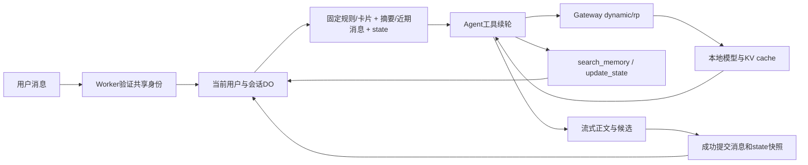

# Tavern Agent：长期方案与七步实施

2026-10-03。目标：有状态、长期记忆、多轮工具推理的角色Agent，优先适配32K且prefill/decode慢的本地模型。当前继续实现自动压缩与续写；后续逐步验证发布，不将尚不存在的工具塞进提示词。

代码入口为主分支`apps/tavern`。保留现有数据和ID、角色卡、共享认证、候选、流式正文、停止、续写、重新生成、编辑分支和导出。

## 参考结论

口述Tarven暂按SillyTavern研究，尚未确认是否另一个项目。

- [DeepSeek Harness架构](https://github.com/deepseek-ai/deepseek-harness/blob/master/docs/architecture.md)：session、prompt assembly、tools、model adapter、agent loop分工，一个turn可包含多个模型/工具step。采用这些职责划分和可重建请求记录；不引入Cordis插件系统、代码执行或子Agent。
- [SillyTavern提示词](https://docs.sillytavern.app/usage/prompts/)与[角色卡](https://docs.sillytavern.app/usage/core-concepts/characterdesign/)：固定角色定义和可变会话上下文分离。沿用标准卡片，不把标签、作者备注、扩展脚本放进prompt，不复制其全套预设。
- [SillyTavern摘要](https://docs.sillytavern.app/extensions/summarize/)：摘要绑定消息位置，编辑后回到有效版本；摘要有误差，保留原文与来源，避免每轮额外总结。
- [SillyTavern缓存配置](https://docs.sillytavern.app/administration/config-yaml/)与[llama.cpp server](https://github.com/ggml-org/llama.cpp/blob/master/tools/server/README.md)：变化前缀会限制缓存复用；`cache_prompt`及实际缓存计数/时序需在部署版本核实。
- [Cloudflare Durable Objects存储](https://developers.cloudflare.com/durable-objects/best-practices/access-durable-objects-storage/)：每对象私有事务存储，新namespace采用SQLite；[并发控制](https://developers.cloudflare.com/durable-objects/api/state/)不能包住长模型请求。

以上为一手文档研究与本项目设计，未安装或逐行复刻参考项目。用户所说的会话对象对应 **Durable Objects**，它不保存本地GPU的KV cache。

## 当前实现与改进

| 已有 | 问题 | 改进 |
| --- | --- | --- |
| Worker一次dynamic/rp + SSE | 无工具续轮 | 无工具快路径+工具续轮 |
| D1完整消息、UUID、180秒生成lease | 尚无state/summary | 会话DO统一管理回合和版本 |
| 后台/props探测n_ctx | 运行容量会变化，不能写死32K | 按已发现窗口缩放，明确超限才压缩 |
| 每轮倒推滑动历史 | 频繁改变旧前缀 | 保留历史，超限摘要形成低频checkpoint |
| 世界书关键词注入system | 激活变化会改前缀 | 保留现有功能，RAG后置 |
| 只在最新user副本加格式提醒 | 下一轮该提醒消失 | 首批保留验证过的行为，后续持久模型投影 |

Gateway仍固定`dynamic/rp`，前端不提交任意URL/上游模型/密钥。`skipCache:true`保留，它禁用回复缓存，与模型KV缓存不同。

## 七步执行顺序

首批预算、观测和协议隔离已随PR #36–#38上线，实测见[TAVERN-PROGRESS.md](TAVERN-PROGRESS.md#agent-第一阶段最终交付2026-10-04)。当前32768窗口/1个slot，重复前缀两条请求分别复用422/426 tokens；连续增长三轮仍0命中。因此自动缩放、超限摘要和无硬限续写修订已发布；鉴权统一迁移及真实复验后再推进DO/state/tools；增长历史与slot缓存行为继续实测。工具能力元数据可用，真实工具闭环未验收。自动压缩修订已随PR #40发布；当前真实复验因共享签发字段改为roles/email/username与旧guard冲突返回403，用户决定另行统一迁移鉴权，完成后再补真实压缩/cache验收。

| 步骤 | 交付 | 验收 |
| --- | --- | --- |
| **1 短prompt与自动压缩** | 精炼写作规则、保留已验证候选协议、按发现的容量保留历史、超限摘要、长度结束自动续写、请求缓存复用、首正文/usage/cache时序 | 16K/32K/未知、长卡片、最近完整轮次、续写/重生成、自定义保留、同次候选、真实连续轮次 |
| **2 每会话DO** | SQLite DO、用户+会话路由、回合占用/取消/UUID、全部会话接口统一、旧会话惰性导入 | 重启、隔离、并发、重复请求、导入失败、ID/版本保留、停止/分支/删除/导出 |
| **3 state与摘要** | 有界JSON状态、回合前后快照、摘要和总结到的消息版本、阈值压缩 | 成功才提交、重生成恢复前态、分支无未来事实、摘要失败不删原文、短聊不多调模型 |
| **4 最小Agent loop** | search_memory/update_state、工具结果续轮、工具结果追加、无固定轮数/总输出量/运行超时 | 0/1/2工具续轮、原生tools兼容、非法参数、重复调用、无进展停止、取消、正文不泄露协议/思考 |
| **5 长记忆检索** | 摘要块+原文锚点、会话内关键词/全文检索；后续再加embedding | 旧事实找回、否定更正、出处、中文召回、当前会话/分支隔离、未命中不伪造 |
| **6 性能与恢复** | 模型投影追加、低频压缩、有限slot亲和、公平调度、断流恢复 | 长聊/切会话cached tokens和TTFT实测、route变化、取消/重启、不盲目重发 |
| **7 世界书RAG** | 版本化分块、关键词+向量、metadata过滤、有界召回 | 来源/权限、无关条目不注入、召回质量、额外成本/缓存影响 |

第1步修订增加摘要checkpoint，原消息与版本仍完整保存；不再按固定块删除模型可见历史。第3/5步补齐state与按需找回。世界书新增RAG后置，不删除现有导入、绑定与关键词功能。

## 最终结构

保持直接的TypeScript模块：prompt、model adapter、tools、agent loop、session storage。先不引入通用插件框架或Agents SDK；确有收益再评估。

## 每轮prompt与缓存顺序

逻辑上每次step包含角色卡、state JSON、长期摘要、近期消息、当前输入和实际可执行的工具；按稳定到变化排列：

1. 短system：写作规则、工具规则和候选协议；稳定排序的工具schema。
2. 角色卡、用户persona、卡片额外约束；不重复抄卡片，不自动改用户自定义。
3. 低频摘要checkpoint，不每轮重写。
4. checkpoint后的完整近期消息，平时追加，不重排。
5. 当前state JSON、必要检索结果、当前用户输入；动态内容靠后，最新快照覆盖旧快照。
6. 本回合assistant tool_calls与对应tool results；冻结基础prompt并追加结果，不每step重拼。

JSON紧凑编码、稳定键序；移除模型无关的锁、revision、更新时间和日志字段。state不放在卡片或长历史之前；空摘要显式为空，不伪造记忆。工具返回是数据，不能改变system或权限。

实际chat template可能把tools渲染在system之前，所以检验最终token前缀，不只比较messages数组。持久模型投影应保留实际发过的应用提醒、工具协议和需要的模板内容；首批仍有世界书变化/最新提醒带来的缓存边界限制，不声称全历史缓存命中。

精炼写作规则：保持角色口吻与已发生事实，只写角色可知的信息，用户决定自己的行动和台词；具体对白/动作推进当前场景，不复述灌水或擅自跳时，保留回应空间。段落/长度随情节，不追加长篇禁词表和强制反思。

## 上下文自动缩放与慢模型优化

2026-10-04按用户批注修订：32K是目前本地模型的运行容量，不是应用硬上限。取消12288输入目标、32768规划钳制、固定历史淘汰、maxTokens字段和总输出额度，也取消最多3次模型请求及整轮deadline。未来发现16K、64K等容量时直接使用真实容量；未知容量保留全部有效历史，不猜窗口。

短会话只发一条正常推理请求。估算输入超过已发现容量，或上游明确报上下文超限时，才压缩较早完整轮次；保留当前输入、角色设定和原始消息。摘要请求自身超限或返回length时按时间顺序拆小来源再压缩。摘要只记录已发生事实、关系、否定/更正和未决线索，绑定消息ID与内容指纹；后续平时追加历史，不逐轮改摘要。

字符估算沿用倍率，加入256 tokens的模板估算量，不预扣总输出预算；优先完善真实tokenizer校准，但不每轮额外计数请求。核心卡片和当前输入单独超过物理容量且无可压缩历史时报告真实错误，不静默修改用户内容。

模型返回length时保存并继续同一回复，沿用请求ID、流和候选解析器；新增模型输出同步进入下一次续写输入，必要时先压缩。特别长的当前回复只压缩模型投影的较早部分，完整正文仍持续保存。候选完成后正常stop才提交候选。无进展、非法协议、用户停止、断连或上游故障仍正常结束，不靠固定轮数强行收尾。

提示词引导直接写当前场景、按需调用工具并及时回答；不强制规划→反思→润色，不重放长思考。工具执行循环跟随模型实际返回，长度目标只放system建议，不设每回合输出总额或运行时长。

现有180秒占用改为持续续租的恢复租约，覆盖摘要和生成；所有消息与摘要写入检查当前生成ID，失去占用立即取消。租约用于进程中断后的恢复，不限制一次回复运行时间。DO迁移留在下一步，当前只增加D1 nullable摘要列，减少同一批改动范围。

## 两个简洁工具

| 名称 | 参数 | 描述 | 返回 |
| --- | --- | --- | --- |
| search_memory | query:string | 查本会话相关旧事实。 | 最多3条`id,text,source`短记录 |
| update_state | patch:object | 更新已发生的场景事实。 | 暂存结果`{ok:true}`或短字段错误 |

不提供会话ID/owner参数、SQL、文件或任意URL。执行环境由服务端绑定；不允许跨会话查写。state字段先围绕实际需求选择scene/facts/relationships/inventory，不预建复杂游戏引擎；白名单、深度、总字节和单项长度有界，未提供字段保留，删除语义明确。

原生function calling优先，必须在真实模型/模板完成tools往返。若不支持，暂保留单次生成；文本动作协议须另做结构化输出、完整增量解析和正文隔离验收，不能从普通剧情文字用正则触发更新。不执行角色扩展脚本。工具未闭环前不暴露schema。

## DO与迁移一致性

Worker先验证共享身份/访问权，再按稳定的owner+session组合路由对象；每会话一个DO，避免全局DO。隔离会话数据与回合，不等于隔离共享GPU或为每会话常驻KV。

D1保留角色库、世界书、设置和会话目录，R2保持私有附件。会话正文/版本/state/摘要/tool steps/回合占用最终由DO SQLite统一管理。create/get/generate/stop/update/fork/delete/export一起通过存储入口，不能只迁生成并保留两套锁。

惰性导入旧会话：确认旧生成已结束，读取全部版本/设置，保留ID/ordinal/终态；DO事务导入并核对数量与内容摘要后发布迁移标记。失败保留旧D1真源，不删记录；切换后旧消息只读，禁止双后端同时写。回滚先暂停会话写入并导出新事件，不能回到陈旧D1覆盖历史。

迁移标记/目录和DO无法跨库原子提交，需持久、可重试的完成记录和幂等同步；明确“DO已提交、目录待同步”，不能把目录失败当会话未写入。先在隔离预览验证兼容迁移，再上生产。

短事务领取占用，外部模型await期间允许stop进入；不持有blockConcurrencyWhile。重复requestId回放已有结果，同会话其他请求明确冲突。重启未完成回合可标记中断，不自动重复模型请求。

update_state暂存于本回合并可供工具续轮读取；最终正文正常完成时，与message/快照/revision同DO事务提交。尚未最终stop的续写、取消/断流/工具失败不提交推测状态。重生成从被替换回合前态开始，新成功版本才切选中状态；分支创建新DO，只复制分支点之前的有效state/摘要，不能继承未来剧情。续写保留部分正文，不预提交其未完成叙事状态。

## 摘要与记忆检索

摘要保存确认事件、关系、约定、未决线索和必要时序；state保存当前事实，两者避免重复。记忆带source消息/版本锚点，更正/否定覆盖旧事实，不把推测存成真。

只在上下文超限时自动压缩，不每轮独立总结。原文从不淘汰，模型投影以有效摘要替换旧轮次；摘要失败保留原文和上一有效checkpoint，不无声丢事实。压缩请求计入调度与缓存观测，但不计入固定轮数或输出额度。

先用会话内关键词/SQLite全文检索，中文分词召回单独验证；模型需要旧细节时才查memory。后续embedding为检索增强，不每轮重嵌入全历史。世界书RAG须具备版本、来源和过滤，有界top-k，不把整本文本塞进system。

## 缓存实测和发布标准

保留Gateway完整payload/eventId/三项metadata、skipCache:true。请求cache_prompt:true本身不是提速证据，llama.cpp本已默认true；Gateway透传、服务slot保留和template决定实际复用。后续slot亲和只针对实际支持的服务，有租约、公平调度和有限容量；不把UUID直接当slot，不为每会话无限保存GPU缓存。

同卡连续至少3轮，再切会话并返回；另测卡片变化、摘要checkpoint、超过发现窗口、重生成和取消。记录估算输入/实际prompt_tokens/cached_tokens、首正文TTFT、模型端首正文、prefill_ms/decode_ms、总耗时。缺字段null，计数不完整不算伪命中率；冷/热标签描述测试序列，只有计数证实实际缓存。Worker既有10%日志采样，验收可结合Gateway完整响应。

首批精简候选协议在真实验收中漏候选，已恢复此前固定协议，保留最新user副本提醒；不为字数少牺牲现有功能。摘要checkpoint已实现，按需长期记忆检索、DO与多轮工具尚未上线。各步区分代码、自动化/固定Linux视觉、真实JWT/API、真实模型/cache、生产发布。默认提示只升级精确匹配已知旧默认，不覆盖自定义。

主代理修改并提交任务文件，默认可见文字变化先生成Linux截图、审阅/import；新子代理推分支/PR等待全部必需状态，包含最新main后squash。核验Workers Builds自动发布SHA与health版本，不重复手动部署。DO/state阶段补隔离存储验证与兼容迁移，不只推前端遗漏数据。
