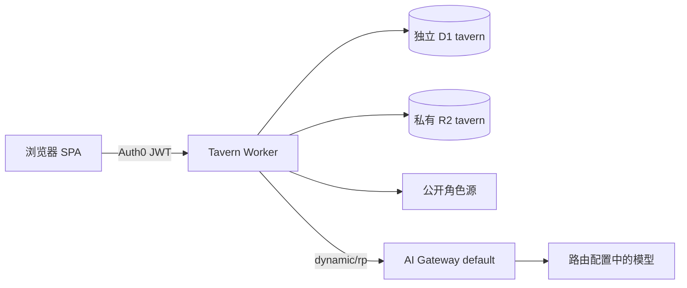

# Tavern · 方案与实施路线图

日期：2026-10-03。目标：在 Hasbai monorepo 提供私人角色扮演对话应用，完成网络搜卡、安装、本地角色卡/世界书导入、持久会话与 `dynamic/rp` 推理闭环。财务三表边界不适用于 Tavern；不改动财务、博客或 Zboard 数据。

整体调用、单次正文与候选、动态短上下文预算见 [HTML 架构图](TAVERN-ARCHITECTURE.html)。

代码入口为仓库根下 `apps/tavern`；仓库名 `financial` 不改变应用归属。当前交付状态见 [TAVERN-PROGRESS.md](TAVERN-PROGRESS.md)，模型参数、默认关闭思考、模型选择与续聊候选的实现契约见 [TAVERN-MODEL-SETTINGS.md](TAVERN-MODEL-SETTINGS.md)。

## 产品与首版交付

| 页面 | 可执行功能 |
| --- | --- |
| 角色库 | 搜索已安装角色、导入 JSON/PNG/CHARX、创建/编辑角色、查看设定与来源、导出原卡、删除、选择开场白开始对话 |
| 发现 | 输入关键词、选择公开来源、按热度/近期热门/发布或更新时间/评分排序、分类与自定义标签、分页、查看作者/源页面、安装角色；安装相同内容去重，不自动覆盖本地编辑 |
| 世界书 | 独立 JSON 导入/导出、查看编辑原文、条目数量、启用/停用，给会话选择世界书；内嵌角色书自动生效 |
| 对话 | 会话列表、角色与用户 persona、流式发送/停止、持久化历史、重试、重新生成、编辑历史并派生新会话、导出 JSONL、删除会话 |
| 设置 | RP模型、默认关闭思考、采样参数、用户名称/persona、系统提示、输出上限、主题；模型路由由服务端固定，不接受客户端覆盖 |

首版不执行外来 JS/Lua、正则替换脚本或扩展工具，不提供多人群聊、图像生成、语音或全量 SillyTavern 插件兼容。未知扩展和资源留在原始卡及导出中；兼容导入不等于执行全部扩展。不会提供伪造角色推荐、示例历史、评分或人数。只有 e2e 独立夹具有合成内容。

## 官方资料与设计依据

1. [CCv2 规范](https://github.com/malfoyslastname/character-card-spec-v2/blob/main/spec_v2.md)：核心字段、内嵌 character_book、`{{original}}`、未知扩展保留；creator_notes 不加入模型提示。
2. [CCv3 规范](https://github.com/kwaroran/character-card-spec-v3/blob/main/SPEC_V3.md)：`ccv3` PNG 元数据优先、CHARX card.json、nickname、资源引用、独立 lorebook_v3。
3. [SillyTavern World Info](https://docs.sillytavern.app/usage/core-concepts/worldinfo/)：关键词、扫描深度、常驻、选择性副关键词、排序、递归与预算；界面不复制全套复杂控制面板。
4. [AI Gateway 动态路由](https://developers.cloudflare.com/ai-gateway/features/dynamic-routing/usage/) 与 [Workers binding](https://developers.cloudflare.com/ai-gateway/usage/worker-binding-methods/)：2026-10-02 文档已支持 `AI.run('dynamic/rp', OpenAI chat completions, { gateway: { id } })`。实现采用文档规定的 `AI.run('dynamic/rp', input, { gateway: { id: 'default' } })`，跳过缓存；Gateway 归属日志按 [模型方案](TAVERN-MODEL-SETTINGS.md) 保留，完整请求与回复存储开启。旧兼容 universal binding 在生产返回500，已改用原生动态路由调用；本地旧版 workerd 远程绑定 internal error 不能代表生产结果。默认 BYOK alias 与计费须真实验证，不能据 mock 宣称线上推理可用。
5. [Hugging Face Dataset Viewer 搜索](https://huggingface.co/docs/dataset-viewer/search)、[公开角色集](https://huggingface.co/datasets/G-reen/TheatreLM-v2.1-Characters)：下载固定 revision `eb8597aec4e3e114b2d28b86c3e2496dd48c5af3` 的完整 worlds.json，SHA256校验后校验5011条原始记录，隔离9条名称损坏记录后同步5002条可用角色至D1；原数据不改写。远端 /search 实测超时/500，故按服务端目录分页检索。安装时从同步内容读取，不相信客户端传回的角色定义；保留 CC-BY-2.0 署名、来源版本与转换标记。
6. [Chub](https://www.characterhub.org/about)、[SillyTavern 官方导入实现](https://github.com/SillyTavern/SillyTavern/blob/release/src/endpoints/content-manager.js)：标准角色 PNG 下载及 metadata 映射。首次探测403；本轮普通请求和生产Worker均恢复200，实测官方搜索排序、topics标签及PNG下载。以Chub为默认来源，不绕过访问保护；失败仍明确显示。
7. [RisuRealm API](https://realm.risuai.net/help/api)：仅允许文档化接口且推荐客户端使用。公开文档只有下载，没有搜索契约；首版不使用其未文档化搜索端点。
8. [CharaVault API](https://charavault.net/)：公开搜索接口与下载契约存在，当前探测返回 403且要求年龄验证；首版不依赖、不绕过其年龄或访问检查。
9. [Workers Static Assets](https://developers.cloudflare.com/workers/static-assets/)、[D1 batch](https://developers.cloudflare.com/d1/worker-api/d1-database/#batch)、[私有 R2](https://developers.cloudflare.com/r2/api/workers/workers-api-reference/)：静态 SPA、关系存储及原始文件分开。

## 架构与边界

`apps/tavern`：Svelte 5/Vite SPA，复用 `@hasbai/ui` Luma、Lucide 与 `@hasbai/auth` 统一配置。Worker `tavern` 负责 JWT、D1/R2、搜索适配器、Prompt 和推理。域名 `tavern.hasbai.xyz`。

Auth0：复用北极小站共享配置（现有API标识为 `https://financial.hasbai.xyz/api`），禁止Tavern audience限定；现有 SPA client 增量加入回调/logout/origin。JWT 验签/exp/issuer/audience 在 Worker 完成，共享顶层 role 要求 superadmin，实际用户名使用公共 `https://hasbai.xyz/username` claim。数据按 sub 归属，所有查询含 owner。客户端只含公开配置与内存 Access Token。财务 PostgreSQL 权限封装限制不适用于独立 Tavern Worker。

D1 公共 source_catalog/source_releases 保存固定版本目录，只有完整同步后原子切换，不包含私人数据。私人 D1 表：characters（完整卡 JSON、摘要、来源、原文件与头像 key、内容 hash）、worldbooks（原始书 JSON 与启用）、sessions（角色快照、persona/参数、generation lock）、messages（角色/content/status/request ID/顺序）、settings（用户 persona 和生成参数）。已安装角色删除不删除既有会话快照。R2 原文件私有，头像由 Bearer API 转 Blob URL；不创建公共桶，不自动加载角色扩展资源；发现页只显示经过HTTPS/固定头像域校验的公开Chub缩略图。

导入大小限制、PNG chunk 长度/CRC、ZIP 条目数量/未压缩总量/路径遍历验证在解析前执行。CHARX 支持 card.json 与内嵌主头像，原压缩包完整保留可下载；资源脚本不执行。远端安装 URL 只由适配器构造、固定 HTTPS 主机，重定向逐跳校验，有限时与响应大小。HTML 永远转义；聊天按纯文本显示角色动作和对白，链接不自动触发抓取。

## Prompt 与世界书契约

顺序：系统/用户 persona → before_char 世界书 → 角色描述、性格、场景 → after_char 世界书 → 示例对白 → post_history_instructions与候选协议（合并一个前置system）→ 完整历史消息。`system_prompt` 与 `post_history_instructions` 的 `{{original}}` 合并默认值；`{{char}}`/`{{user}}`/`<char>`/`<user>` 支持，V3 nickname 优先。creator_notes、标签、来源不进入 Prompt。

支持 V2/V3 book 与 SillyTavern entries 对象导入；每个条目只插入一次。禁用不触发、constant 常驻、主关键词与 selective 副关键词逻辑、scan_depth、case_sensitive、priority、insertion_order、before/after_char，递归扫描有迭代上限。公开语料的散文世界书转换为常驻条目，不推断原数据未定义的关键词。正则与复杂 ST 扩展保留但不执行，解析输出能力状态。中文按字符、英文按保守字符估算 tokens（不是模型 tokenizer 精确值），容量按上游实际n_ctx及明确超限反馈更新并预留输出；后台探测不阻断对话，未知时保留核心设定和最近完整轮次。优先保留系统设定与最新完整轮次；超大的设定/单轮明确报错，不能静默切掉最新输入。

## 生成、重试与编辑契约

每次发送携带 UUID requestId。D1 原子锁保护每会话仅一个生成；同请求已存在返回既有生成状态而不再次调用模型。用户消息与 assistant pending 先落库；流式完成后 assistant completed。失败、用户停止和上游不完整分别落 error/aborted，不纳入后续 Prompt。服务器每批字符/间隔保存部分文本，刷新能看见部分和状态；超时锁恢复标记中断，不自动再扣费。

停止使用专属 API 改状态；流式泵检测停止并取消上游，不仅隐藏 UI。客户端断网通过 reader.cancel 导致中断；所有结尾都释放本次锁。重新生成追加替代助手消息，旧内容保留；显示最新版本（包括失败或部分回复），不让旧成功版本遮住本次失败。编辑历史创建新会话并复制到编辑点，保留原会话。没有自动隐式重试或切模型。长请求设置最长生成时限，终止异常 upstream SSE，过滤 reasoning_content。

## 2026-10-03 使用反馈修订

- 标识：登录、导航与favicon使用博客已有北极小站雪花SVG；无新生成品牌图形。
- 默认来源Chub：`popular → star_count`（官方前端Popularity，返回下载热度）、`trending → trending`、`newest → created_at`、`updated → last_activity_at`、`rating → rating`，由上游全量排序再分页；`topics`接收逗号分隔标签，常用分类映射到真实标签，并保留任意标签输入。普通本机请求与生产Worker已返回200。契约依据为[Chub官方标签说明](https://docs.chub.ai/docs/the-basics/character-creation)、[官方前端](https://chub.ai)的实际参数及公开API实测。TheatreLM原始字段没有每角色热度/日期/分类，故仅开放关键词及原目录顺序，不伪造这些指标。
- 目录质量：原始5011条中9条名称超过160字符，包括截图第2921条459字符乱码；公共发现与直接安装均拒绝，已有私人安装与历史保留。同步manifest记录拒收行号/理由，固定文件hash与完整校验保留；目录标题限制两行。
- 输入：默认Enter发送、Shift+Enter换行，中文IME组合中及keyCode229不发送。用户翻看历史时停止追随滚动。
- 中断诊断：用户Abbess Elara回复在生产存为completed、正文16字、maxTokens1024；原请求未保留finish_reason，因此无法恢复其精确终态。以相同角色、历史、输入和dynamic/rp复现：1024预算返回length、completion_tokens=1024，含大量reasoning；4096返回stop。原实现把任何非空finish_reason（除content_filter）当成功，这是静默截断的确定缺陷。新增nullable finish_reason，历史无可靠终态不猜测改写；仅stop和非空新增正文可完成，length/filter/未知类型/无终态EOF、超时、用户停止、断连、过期分别持久化。结构日志仅记录状态/字符数/token数/耗时，不记录正文、推理或凭据。
- 默认输出预算提高至4096，旧设置/会话快照中原1024默认一并升级；其他值保留。允许128–8192，会话设置可单独调整。仍可能达到预算，此时保存部分回复并给出继续/重新生成/调整长度入口，无自动重试或备用模型。
- 显式继续：新消息版本保留旧前缀，原用户消息不重复落库；Prompt必须保留原轮次，预算先计入续写指令再选择完整历史，容量不足返回400并释放锁，不做无上下文拼接。JSONL保留各版本状态及终止原因。
- 视觉：最大740px阅读列、32px角色标识、按内容宽度的用户消息、精简标题与按需编辑操作、稳定底部输入区；桌面、窄屏、深色、长对话及持久中断状态分别验收。

## API 清单

- GET /health：service 与 Worker version，不含配置或密钥。
- GET/POST /api/characters；GET/PATCH/DELETE /api/characters/:id；GET /api/characters/:id/export；GET /api/characters/:id/avatar。
- GET /api/discover?q=&source=&page=&sort=&tags=；POST /api/install {source,id}；固定适配器，不提供任意 URL 代理。
- GET/POST /api/worldbooks；PATCH/DELETE /api/worldbooks/:id；GET /api/worldbooks/:id/export。
- GET/POST /api/sessions；GET/DELETE /api/sessions/:id；PATCH /api/sessions/:id 配置；POST /api/sessions/:id/generate；POST /api/sessions/:id/stop；POST /api/sessions/:id/fork；GET /api/sessions/:id/export。
- GET/PUT /api/settings；GET /api/models。

## 实施路线与验收门槛

| 阶段 | 实施 | 通过条件 |
| --- | --- | --- |
| 0 研究与基础设施 | 公开规范/实时来源探针、隔离工作树、D1/R2、Auth0、Gateway | 独立资源、不会写入其他应用；记录真实失败依赖 |
| 1 可移植核心 | 类型、卡/世界书解析、PNG/CHARX、Prompt/预算 | fixture 覆盖 Unicode、错误格式、zip bomb、未知字段、优先级/递归/截断 |
| 2 服务端闭环 | 认证、持久会话、原子锁、幂等、SSE、停止/再生成/分支 | D1迁移实跑；生成失败不丢历史、不自动重复推理；越权拒绝 |
| 3 产品界面 | 角色库/发现/世界书/对话/设置、窄屏/深色/键盘 | 真实可操作流程；合成数据只在独立测试入口 |
| 4 仓库交付 | Tavern workflow、coverage manifest、固定 Linux 截图与严格 CI、PR squash | check/visual/blog-check/blog-visual及受影响 Zboard/Tavern 检查全部成功；包含最新 main |
| 5 线上验收 | Workers Builds main 自动构建、线上版本、真实 JWT/搜卡安装/模型流式与停止 | 生产版本等于合并版本、无人工重复部署；真实链路单列证据 |
| 后续 1 | 更多公共角色源、世界书高级位置、正则受限执行 | 先做上游契约/安全测试、回归导出无损 |
| 后续 2 | 消息变体选择、可视化角色/世界书编辑、persona 库、精确 tokenizer | 迁移保留所有会话/版本，路由上下文校准 |
| 后续 3 | 多角色编排、图片/语音、分享、插件沙箱 | 用户另行明确范围、存储与访问权限，不混进首版 |

后续增强不是当前核心闭环的替代。实现完成但上游/生产配置未验收时，文档必须注明待验收，不标为已上线。

## 开发、CI与发布

`pnpm dev:tavern` 为5176；Worker `pnpm --filter tavern exec wrangler dev --port 8787`；独立 API proxy。本地只做固定 Linux 视觉构建与轻量源码检查；完整测试/typecheck/build在 PR CI。`pnpm visual:tavern --all`生成本地候选，审阅后 `pnpm visual:baseline:import-local <目录> --reviewed`。Tavern manifest覆盖所有页面/状态，iPhone WebKit优先与desktop。

新 Worker 配置 Cloudflare Workers Builds：同 GitHub仓库，rootDirectory `/`，install `pnpm install --frozen-lockfile`，build `pnpm --filter tavern build`，deploy `pnpm --filter tavern exec wrangler deploy`，生产 main，paths include `apps/tavern/**`、`packages/**`、`pnpm-lock.yaml`、`pnpm-workspace.yaml`、`package.json`。迁移先在独立测试 D1验证，再生产迁移。不手动重复部署。主代理编辑/提交、导入基线后，由新子代理推送/建PR/等待CI/合并/部署核验。
