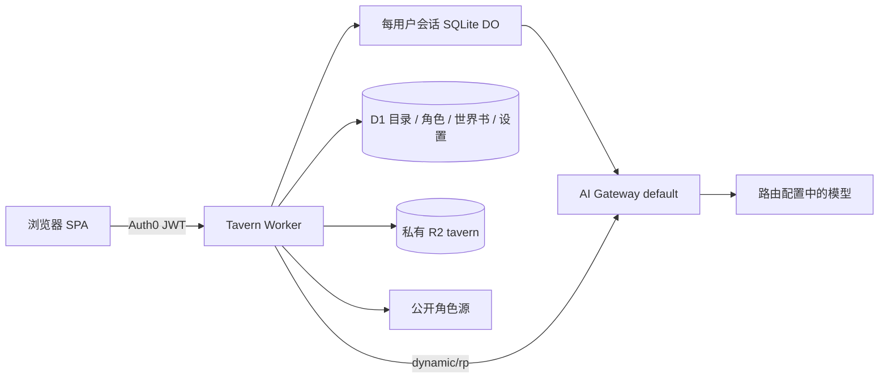

# Tavern 架构与产品契约

开发边界与按需入口见[README](README.md)；本页源码路径相对 `apps/tavern`。当前发布/真实模型的证据限制见[PROGRESS](PROGRESS.md)，辅助图解见[ARCHITECTURE.html](ARCHITECTURE.html)。

## 产品与范围

| 页面 | 可执行功能 |
| --- | --- |
| 角色库 | 搜索已安装角色、导入 JSON/PNG/CHARX、创建/编辑角色、查看设定与来源、导出原卡、删除、选择开场白开始对话 |
| 发现 | 输入关键词、选择公开来源、按热度/近期热门/发布或更新时间/评分排序、分类与自定义标签、分页、查看作者/源页面、安装角色；安装相同内容去重，不自动覆盖本地编辑 |
| 世界书 | 独立 JSON 导入/导出、查看编辑原文、条目数量、启用/停用，给会话选择世界书；内嵌角色书自动生效 |
| 对话 | 会话列表、角色与用户 persona、右侧用户气泡、无气泡角色正文、单行自动伸展输入、圆形发送/停止、回答末尾操作、持久化历史、重试、重新生成、编辑历史并派生新会话、导出 JSONL、删除会话 |
| 设置 | RP模型、默认关闭思考、采样参数、用户名称/persona、系统提示、主题；模型路由由服务端固定，不接受客户端覆盖 |

当前不执行外来 JS/Lua、正则替换脚本或扩展工具，不提供多人群聊、图像生成、语音或全量 SillyTavern 插件兼容。未知扩展和资源留在原始卡及导出中；兼容导入不等于执行全部扩展。不会提供伪造角色推荐、示例历史、评分或人数。只有 e2e 独立夹具有合成内容。

## 架构与边界

`apps/tavern`：Svelte 5/Vite SPA，复用 `@hasbai/ui` Luma、Lucide 与 `@hasbai/auth` 统一配置。Worker `tavern` 负责 JWT、D1/R2、搜索适配器、Prompt 和推理。域名 `tavern.hasbai.xyz`。

JWT 和本人/全站管理授权遵循[AUTHORIZATION](../AUTHORIZATION.md)。会话持久化、迁移与删除以[AGENT](AGENT.md#do与迁移一致性)为唯一详细契约。

D1 公共 source_catalog/source_releases 保存固定版本目录，只有完整同步后原子切换，不包含私人数据。私人 D1 表：characters（完整卡 JSON、摘要、来源、原文件与头像 key、内容 hash）、worldbooks（原始书 JSON 与启用）、sessions（会话目录、可靠世界书引用与迁移占用哨兵）、messages（迁移前原文来源，只读保留）、settings（用户 persona 和生成参数）。会话角色快照、设置、全部消息版本、摘要与生成占用由每会话SQLite DO统一管理；旧 D1 原文按 AGENT 的惰性迁移契约保留。已安装角色删除不删除既有会话快照。R2 原文件私有，头像由 Bearer API 转 Blob URL；不创建公共桶，不自动加载角色扩展资源；发现页只显示经过HTTPS/固定头像域校验的公开Chub缩略图。

导入大小限制、PNG chunk 长度/CRC、ZIP 条目数量/未压缩总量/路径遍历验证在解析前执行。CHARX 支持 card.json 与内嵌主头像，原压缩包完整保留可下载；资源脚本不执行。远端安装 URL 只由适配器构造、固定 HTTPS 主机，重定向逐跳校验，有限时与响应大小。HTML 永远转义；聊天按纯文本显示角色动作和对白，链接不自动触发抓取。

## 角色卡与世界书

`system_prompt` 与 `post_history_instructions` 的 `{{original}}` 合并默认值；`{{char}}`/`{{user}}`/`<char>`/`<user>` 支持，V3 nickname 优先。creator_notes、标签、来源不进入 Prompt。

支持 V2/V3 book 与 SillyTavern entries 对象导入；每个条目只插入一次。禁用不触发、constant 常驻、主关键词与 selective 副关键词逻辑、scan_depth、case_sensitive、priority、insertion_order、before/after_char，递归扫描有迭代上限。公开语料的散文世界书转换为常驻条目，不推断原数据未定义的关键词。正则与复杂 ST 扩展保留但不执行，解析输出能力状态。输入估算、容量发现、超限压缩和缓存以[Agent 上下文契约](AGENT.md#上下文与摘要)为准。

## 生成、重试与编辑

发送使用 UUID requestId，所有会话操作通过每会话 DO。正文流式与批次落盘，停止真正取消上游；中断和不可靠终态保存实际部分正文，刷新/重复 UUID 读取不再次推理。完整占用、状态事务、重启、SSE 背压与存储故障规则见[AGENT](AGENT.md)。

重新生成追加助手版本，旧内容保留；显示最新结果，包括失败/部分回复，Prompt/state 使用有效成功版本。编辑历史创建新会话并复制到编辑点，原会话保留。用户停止或故障后可显式继续原前缀，length 则按同一 UUID 自动续写。正常正文后独立 Director 的协议和失败隔离见[MODELS](MODELS.md#续聊候选内容与-ui)。

## 对话与发现 UI

- 复用北极小站雪花 SVG，不生成另一套品牌标识。
- Chub 默认来源，排序和 tags 传上游后再分页；TheatreLM 原始字段缺少热度/日期/分类，仅开放关键词与原目录顺序，不能伪造指标。公开目录损坏名称隔离，不改私人安装与历史。
- Enter 发送、Shift+Enter 换行；IME 组合中及 keyCode229 不发送。流式增量、候选展开、输入伸缩和同会话刷新保持阅读位置，用户自行滚动，切会话才初始化到最新。
- 最大 740px 阅读列，右侧用户气泡、无气泡角色正文；单角色隐藏可见姓名与头像，保留无障碍身份。44px 圆形发送/停止，输入单行起步至 200px 后内部滚动；回答末尾提供复制/编辑/重新生成，保留草稿、停止和续写。
- 不把默认约 300–600 字的写作提示当应用硬上限。普通失败保留输入，移动、深色、长对话、持久中断和键盘路径在 manifest 登记。

## API 清单

- GET /health：service 与 Worker version，不含配置或密钥。
- GET/POST /api/characters；GET/PATCH/DELETE /api/characters/:id；GET /api/characters/:id/export；GET /api/characters/:id/avatar。
- GET /api/discover?q=&source=&page=&sort=&tags=；POST /api/install {source,id}；固定适配器，不提供任意 URL 代理。
- GET/POST /api/worldbooks；PATCH/DELETE /api/worldbooks/:id；GET /api/worldbooks/:id/export。
- GET/POST /api/sessions；GET/DELETE /api/sessions/:id；PATCH /api/sessions/:id 配置；POST /api/sessions/:id/generate；POST /api/sessions/:id/stop；POST /api/sessions/:id/fork；GET /api/sessions/:id/export。
- GET/PUT /api/settings；GET /api/models。

## 规范与公开来源

| 来源 | 契约与实现边界 |
| --- | --- |
| [CCv2](https://github.com/malfoyslastname/character-card-spec-v2/blob/main/spec_v2.md)、[CCv3](https://github.com/kwaroran/character-card-spec-v3/blob/main/SPEC_V3.md) | JSON/PNG/CHARX、未知扩展与原卡导出；creator_notes 不进入模型提示 |
| [SillyTavern World Info](https://docs.sillytavern.app/usage/core-concepts/worldinfo/) | 关键词、常驻、扫描深度、递归与排序，不执行全部 ST 扩展 |
| [TheatreLM 目录](https://huggingface.co/datasets/G-reen/TheatreLM-v2.1-Characters) | 固定 revision `eb8597aec4e3e114b2d28b86c3e2496dd48c5af3`，worlds.json 完整 hash/5011 行校验，9 条损坏名称隔离后 5002 可用；CC-BY-2.0 署名、版本与转换标记随卡保存 |
| [Chub](https://docs.chub.ai/docs/the-basics/character-creation) | 固定适配器、真实排序/标签与标准 PNG 下载，不绕过访问保护；上游可用性单独验收 |
| [RisuRealm API](https://realm.risuai.net/help/api)、[CharaVault](https://charavault.net/) | 首版未依赖 Risu 的未文档化搜索或需访问验证的 CharaVault；历史探针结果见交付记录 |
| [AI Gateway 动态路由](https://developers.cloudflare.com/ai-gateway/features/dynamic-routing/usage/) | `worker/gateway.ts` 的 `runRoleplay` 共用原生 `AI.run('dynamic/rp', input, {gateway, returnRawResponse:true, signal})`；完整日志与单次调用约束见 MODELS |

目录先全量校验再原子切换 release，安装只从服务端同步内容读取，不相信客户端传回角色定义。上表固定版本与数量为目录版本数据，外部来源当前可用性不能由历史探针外推。

## 运行与兼容资源

前端 5176；应用目录 `pnpm exec wrangler dev --port 8787` 启动独立 API，Vite 开发代理。Wrangler 配置 Worker、D1、私有 R2 和 SQLite `SESSIONS` binding，兼容日期保留 `2026-10-03`。

`pnpm --filter tavern test:session-runtime` 使用 Wrangler 所带真实 workerd/SQLite 的隔离 harness，验证导入、停止、回放、分支、重启、故障恢复和删除。harness 使用其固定 runtime 支持的兼容日期，不打包进生产；模型是夹具，不能当真实推理验收。

Workers Builds 的 rootDirectory `/`、build `pnpm --filter tavern build`，生产 main；构建监控应用/共享包/workspace 路径。D1 0007/0008 兼容迁移与 DO 来源冻结/分支恢复以[AGENT](AGENT.md#do与迁移一致性)为准。检查与发布步骤仅在[TESTING](../TESTING.md)维护，不重复手动部署。
